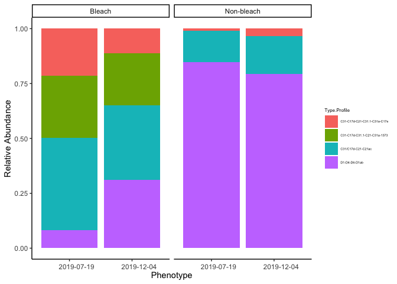

ITS2 Analysis of KBAY Bleaching Pairs
================
EL Strand

# ITS2 Analysis

Complete the following workflow in terminal using SymPortal before
starting this R script: [Emma Strand Notebook
post](https://github.com/emmastrand/EmmaStrand_Notebook/blob/master/_posts/2022-01-14-KBay-Bleaching-Pairs-ITS2-Analysis-Pipeline.md#Troubleshooting).
\#\# Load libraries

``` r
#install_github("pmartinezarbizu/pairwiseAdonis/pairwiseAdonis")
p1 <- c("plyr", "dplyr", "tidyverse", "vegan", "BiocManager", "ggpubr", "janitor", "funrar", "AMR", "ggbiplot", "stats",
        "devtools", "pairwiseAdonis", "lubridate", "ggh4x", "ggfortify", "naniar")
p2 <- c("phyloseq", "ANCOMBC", "DESeq2", "ComplexHeatmap","microbiomeMarker")
load_package <- function(p) {
  if (!requireNamespace(p, quietly = TRUE)) {
    ifelse(p %in% p1, 
           install.packages(p, repos = "http://cran.us.r-project.org/"), 
           BiocManager::install(p))
  }
  library(p, character.only = TRUE, quietly = TRUE)
}
invisible(lapply(c(p1,p2), load_package))
```

    ## 
    ## Attaching package: 'dplyr'

    ## The following objects are masked from 'package:plyr':
    ## 
    ##     arrange, count, desc, failwith, id, mutate, rename, summarise,
    ##     summarize

    ## The following objects are masked from 'package:stats':
    ## 
    ##     filter, lag

    ## The following objects are masked from 'package:base':
    ## 
    ##     intersect, setdiff, setequal, union

    ## ── Attaching packages ─────────────────────────────────────── tidyverse 1.3.1 ──

    ## ✔ ggplot2 3.3.6     ✔ purrr   0.3.4
    ## ✔ tibble  3.1.8     ✔ stringr 1.4.0
    ## ✔ tidyr   1.2.0     ✔ forcats 0.5.1
    ## ✔ readr   2.1.2

    ## ── Conflicts ────────────────────────────────────────── tidyverse_conflicts() ──
    ## ✖ dplyr::arrange()   masks plyr::arrange()
    ## ✖ purrr::compact()   masks plyr::compact()
    ## ✖ dplyr::count()     masks plyr::count()
    ## ✖ dplyr::failwith()  masks plyr::failwith()
    ## ✖ dplyr::filter()    masks stats::filter()
    ## ✖ dplyr::id()        masks plyr::id()
    ## ✖ dplyr::lag()       masks stats::lag()
    ## ✖ dplyr::mutate()    masks plyr::mutate()
    ## ✖ dplyr::rename()    masks plyr::rename()
    ## ✖ dplyr::summarise() masks plyr::summarise()
    ## ✖ dplyr::summarize() masks plyr::summarize()

    ## This is vegan 2.6-2

    ## 
    ## Attaching package: 'ggpubr'

    ## The following object is masked from 'package:plyr':
    ## 
    ##     mutate

    ## 
    ## Attaching package: 'janitor'

    ## The following objects are masked from 'package:stats':
    ## 
    ##     chisq.test, fisher.test

    ## 
    ## Attaching package: 'scales'

    ## The following object is masked from 'package:purrr':
    ## 
    ##     discard

    ## The following object is masked from 'package:readr':
    ## 
    ##     col_factor

    ## 
    ## Attaching package: 'devtools'

    ## The following object is masked from 'package:BiocManager':
    ## 
    ##     install

    ## The following object is masked from 'package:permute':
    ## 
    ##     check

    ## 
    ## Attaching package: 'lubridate'

    ## The following objects are masked from 'package:base':
    ## 
    ##     date, intersect, setdiff, union

    ## 
    ## Attaching package: 'ggfortify'

    ## The following object is masked from 'package:ggbiplot':
    ## 
    ##     ggbiplot

    ## 
    ## Attaching package: 'BiocGenerics'

    ## The following objects are masked from 'package:lubridate':
    ## 
    ##     intersect, setdiff, union

    ## The following objects are masked from 'package:dplyr':
    ## 
    ##     combine, intersect, setdiff, union

    ## The following objects are masked from 'package:stats':
    ## 
    ##     IQR, mad, sd, var, xtabs

    ## The following objects are masked from 'package:base':
    ## 
    ##     anyDuplicated, append, as.data.frame, basename, cbind, colnames,
    ##     dirname, do.call, duplicated, eval, evalq, Filter, Find, get, grep,
    ##     grepl, intersect, is.unsorted, lapply, Map, mapply, match, mget,
    ##     order, paste, pmax, pmax.int, pmin, pmin.int, Position, rank,
    ##     rbind, Reduce, rownames, sapply, setdiff, sort, table, tapply,
    ##     union, unique, unsplit, which.max, which.min

    ## 
    ## Attaching package: 'S4Vectors'

    ## The following objects are masked from 'package:lubridate':
    ## 
    ##     second, second<-

    ## The following object is masked from 'package:tidyr':
    ## 
    ##     expand

    ## The following objects are masked from 'package:dplyr':
    ## 
    ##     first, rename

    ## The following object is masked from 'package:plyr':
    ## 
    ##     rename

    ## The following objects are masked from 'package:base':
    ## 
    ##     expand.grid, I, unname

    ## 
    ## Attaching package: 'IRanges'

    ## The following object is masked from 'package:phyloseq':
    ## 
    ##     distance

    ## The following object is masked from 'package:lubridate':
    ## 
    ##     %within%

    ## The following object is masked from 'package:purrr':
    ## 
    ##     reduce

    ## The following objects are masked from 'package:dplyr':
    ## 
    ##     collapse, desc, slice

    ## The following object is masked from 'package:plyr':
    ## 
    ##     desc

    ## 
    ## Attaching package: 'matrixStats'

    ## The following object is masked from 'package:dplyr':
    ## 
    ##     count

    ## The following object is masked from 'package:plyr':
    ## 
    ##     count

    ## 
    ## Attaching package: 'MatrixGenerics'

    ## The following objects are masked from 'package:matrixStats':
    ## 
    ##     colAlls, colAnyNAs, colAnys, colAvgsPerRowSet, colCollapse,
    ##     colCounts, colCummaxs, colCummins, colCumprods, colCumsums,
    ##     colDiffs, colIQRDiffs, colIQRs, colLogSumExps, colMadDiffs,
    ##     colMads, colMaxs, colMeans2, colMedians, colMins, colOrderStats,
    ##     colProds, colQuantiles, colRanges, colRanks, colSdDiffs, colSds,
    ##     colSums2, colTabulates, colVarDiffs, colVars, colWeightedMads,
    ##     colWeightedMeans, colWeightedMedians, colWeightedSds,
    ##     colWeightedVars, rowAlls, rowAnyNAs, rowAnys, rowAvgsPerColSet,
    ##     rowCollapse, rowCounts, rowCummaxs, rowCummins, rowCumprods,
    ##     rowCumsums, rowDiffs, rowIQRDiffs, rowIQRs, rowLogSumExps,
    ##     rowMadDiffs, rowMads, rowMaxs, rowMeans2, rowMedians, rowMins,
    ##     rowOrderStats, rowProds, rowQuantiles, rowRanges, rowRanks,
    ##     rowSdDiffs, rowSds, rowSums2, rowTabulates, rowVarDiffs, rowVars,
    ##     rowWeightedMads, rowWeightedMeans, rowWeightedMedians,
    ##     rowWeightedSds, rowWeightedVars

    ## Welcome to Bioconductor
    ## 
    ##     Vignettes contain introductory material; view with
    ##     'browseVignettes()'. To cite Bioconductor, see
    ##     'citation("Biobase")', and for packages 'citation("pkgname")'.

    ## 
    ## Attaching package: 'Biobase'

    ## The following object is masked from 'package:MatrixGenerics':
    ## 
    ##     rowMedians

    ## The following objects are masked from 'package:matrixStats':
    ## 
    ##     anyMissing, rowMedians

    ## The following object is masked from 'package:phyloseq':
    ## 
    ##     sampleNames

    ## ========================================
    ## ComplexHeatmap version 2.12.0
    ## Bioconductor page: http://bioconductor.org/packages/ComplexHeatmap/
    ## Github page: https://github.com/jokergoo/ComplexHeatmap
    ## Documentation: http://jokergoo.github.io/ComplexHeatmap-reference
    ## 
    ## If you use it in published research, please cite:
    ## Gu, Z. Complex heatmaps reveal patterns and correlations in multidimensional 
    ##   genomic data. Bioinformatics 2016.
    ## 
    ## The new InteractiveComplexHeatmap package can directly export static 
    ## complex heatmaps into an interactive Shiny app with zero effort. Have a try!
    ## 
    ## This message can be suppressed by:
    ##   suppressPackageStartupMessages(library(ComplexHeatmap))
    ## ========================================

    ## Registered S3 method overwritten by 'gplots':
    ##   method         from     
    ##   reorder.factor DescTools

    ## 
    ## Attaching package: 'microbiomeMarker'

    ## The following object is masked from 'package:phyloseq':
    ## 
    ##     plot_heatmap

#### Read in metadata file

This file was created during the above workflow. Sample ID is the ID
given during sequencing. ColonyID is the ID given during field work and
what the coral is tagged as.

``` r
metadata <- read.csv("Dec-July-2019-analysis/output/ITS2/metadata/metadata.csv", header = TRUE)
```

## Type Profile Level

#### Read in Type Profile dataframes. SymPortal outputs both absolute and relative abundance data as text files.

**Relative abundance**

``` r
relative.abundance.raw <- read.delim("Dec-July-2019-analysis/output/ITS2/processed_data/20220119T075742/its2_type_profiles/5_BleachingPairs_analysis_20220119T075742.profiles.relative.abund_and_meta.txt", sep = "\t", dec = ".", na.strings=c("","NA"))

relative.abundance <- relative.abundance.raw %>% 
  dplyr::rename(Sample.ID = X) %>% 
  dplyr::rename(`C31/C17d-C21-C21ac` = X6) %>%
  dplyr::rename(`C31-C17d-C21-C31.1-C31a-C17e` = X7) %>% 
  dplyr::rename(`C31-C17d-C31.1-C21-C31a-1373` = X8) %>% 
  dplyr::rename(`D1-D4-D6-D1ab` = X9) %>%
  filter(!is.na(Sample.ID))

relative.abundance <- full_join(relative.abundance, metadata, by = "Sample.ID") %>%
  gather(Type.Profile, Relative.Abundance, 3:6)

relative.abundance$Relative.Abundance <- as.numeric(relative.abundance$Relative.Abundance)
relative.abundance$ColonyID <- as.character(relative.abundance$ColonyID)

relative.abundance <- relative.abundance %>% unite(Group, ColonyID, Timepoint, sep = " ", remove = FALSE)
relative.abundance <- relative.abundance %>% unite(Big.Group, Bleach, Group, sep = " ", remove = FALSE)

# mean rel ab by group
relative.abundance2 <- relative.abundance %>%
  group_by(Timepoint, Bleach, Type.Profile) %>%
  mutate(mean_relabund = mean(Relative.Abundance))
```

``` r
bl1 <- relative.abundance %>% 
  replace_with_na_all(condition = ~.x == 0.000000000) %>%
  ggplot(., aes(x = ColonyID, y = Type.Profile)) + 
  geom_tile(aes(fill = Relative.Abundance), color = "black") +
  scale_fill_distiller(palette = "YlGn", na.value = "white", 
                       direction=100, labels = scales::label_percent(scale=100),
                       limits = c(min(relative.abundance$Relative.Abundance), max(relative.abundance$Relative.Abundance))) + 
  theme_classic() +
  theme(axis.text.x.bottom = element_text(angle = 60, hjust=1),
        axis.text.y = element_text(colour = 'black', size = 10, face = 'italic'),) + 
  facet_grid(Timepoint~Bleach, scales = "free",) +
  labs(x="Colony ID", fill="Relative Abundance", y="Clade") 
```

**Absolute abundance**

``` r
absolute.abundance.raw <- read.delim("~/MyProjects/HI_Bleaching_Timeseries/Dec-July-2019-analysis/output/ITS2/processed_data/20220119T075742/its2_type_profiles/5_BleachingPairs_analysis_20220119T075742.profiles.absolute.abund_and_meta.txt", header = TRUE, sep = "\t", dec = ".", na.strings=c("","NA"))

absolute.abundance <- absolute.abundance.raw %>% 
  dplyr::rename(Sample.ID = X) %>% 
  dplyr::rename(`C31/C17d-C21-C21ac` = X6) %>%
  dplyr::rename(`C31-C17d-C21-C31.1-C31a-C17e` = X7) %>% 
  dplyr::rename(`C31-C17d-C31.1-C21-C31a-1373` = X8) %>% 
  dplyr::rename(`D1-D4-D6-D1ab` = X9) %>%
  filter(!is.na(Sample.ID))

absolute.abundance$`C31/C17d-C21-C21ac` <- as.numeric(absolute.abundance$`C31/C17d-C21-C21ac`)
absolute.abundance$`C31-C17d-C21-C31.1-C31a-C17e` <- as.numeric(absolute.abundance$`C31-C17d-C21-C31.1-C31a-C17e`)
absolute.abundance$`C31-C17d-C31.1-C21-C31a-1373` <- as.numeric(absolute.abundance$`C31-C17d-C31.1-C21-C31a-1373`)
absolute.abundance$`D1-D4-D6-D1ab` <- as.numeric(absolute.abundance$`D1-D4-D6-D1ab`)

# calculating relative abundance from raw reads 
absolute.abundance2 <- absolute.abundance %>%
  mutate(Total = select(., `C31/C17d-C21-C21ac`:`D1-D4-D6-D1ab`) %>% rowSums(na.rm = TRUE)) %>%
  mutate(across(c(3:6), .fns = ~./Total))

absolute.abundance2 <- full_join(absolute.abundance2, metadata, by = "Sample.ID") %>%
  gather(Type.Profile, Relative.Abundance, 3:6) %>%
  select(ColonyID, Timepoint, Site, Pair, Bleach, Type.Profile, Relative.Abundance)

absolute.abundance2$ColonyID <- as.character(absolute.abundance2$ColonyID)

bl2 <- absolute.abundance2 %>% 
  replace_with_na_all(condition = ~.x == 0.000000000) %>%
  ggplot(., aes(x = ColonyID, y = Type.Profile)) + 
  geom_tile(aes(fill = Relative.Abundance), color = "black") +
  scale_fill_distiller(palette = "YlGn", na.value = "white", 
                       direction=100, labels = scales::label_percent(scale=100),
                       limits = c(min(absolute.abundance2$Relative.Abundance), max(absolute.abundance2$Relative.Abundance))) + 
  theme_classic() +
  theme(axis.text.x.bottom = element_text(angle = 60, hjust=1),
        axis.text.y = element_text(colour = 'black', size = 10, face = 'italic'),) + 
  facet_grid(Timepoint~Bleach, scales = "free",) +
  labs(x="Colony ID", fill="Relative Abundance", y="Clade") 

ggsave(file="Dec-July-2019-analysis/output/ITS2/figures/ITS2-RelAb-Spp.png", bl2, width = 8, height = 4, units = c("in"))
```

### Calculating C and D ratio

``` r
## add all C rel ab values together 
## divide D by C

CD_ratio <- absolute.abundance2 %>%
  spread(Type.Profile, Relative.Abundance) %>%
  mutate(C = rowSums(.[6:8]),
         D = `D1-D4-D6-D1ab`,
         total = C+D,
         CD_ratio = C/D,
         across(everything(),~ gsub("Inf",1, .)))

CD_ratio$CD_ratio <- as.numeric(CD_ratio$CD_ratio)

write_csv(CD_ratio, file = "Dec-July-2019-analysis/output/ITS2/CD_ratio.csv")
```

#### Plotting

**Relative abundance**

Plotting altgoether.

``` r
ggplot(data = relative.abundance, mapping = aes(x = Timepoint, y = Relative.Abundance, fill = Type.Profile)) +
    geom_bar(position="fill", stat="identity") +
    ylab("Relative Abundance") +
    facet_grid(~Bleach) +
    #scale_fill_manual(values = cols) +
    labs(x = "Phenotype") +
    theme_classic()+
    theme(axis.text.x = element_text(size=rel(1), vjust = 0.3, hjust = 0.3)) +
    theme(legend.title = element_text(size = 6), 
               legend.text = element_text(size = 4))
```

<!-- -->

``` r
ggplot(data = relative.abundance, mapping = aes(x = Big.Group, y = Relative.Abundance, fill = Type.Profile)) +
    geom_bar(position="fill", stat="identity") +
    ylab("Relative Abundance") +
    #facet_grid(~Bleach) +
    #scale_fill_manual(values = cols) +
    labs(x = "Colony ID", title = "All samples by ID #. Timepoints next to each other") +
    theme_classic()+
    theme(axis.text.x = element_text(size=rel(1), angle = 90, vjust = 0.3, hjust = 0.3)) +
    theme(legend.title = element_text(size = 6), 
               legend.text = element_text(size = 4))
```

    ## Warning: Removed 4 rows containing missing values (geom_bar).

<!-- -->

``` r
ggplot(relative.abundance, aes(x = ColonyID, y = Type.Profile)) + 
  geom_point(aes(size = Relative.Abundance, fill = Type.Profile), alpha = 0.75, shape = 21) + 
  scale_size_continuous(limits = c(0.000001, 100), range = c(1,17), breaks = c(1,25,50,100)) + 
  facet_nested_wrap(facets =  vars(Bleach, Timepoint), nest_line = TRUE) + 
  labs(x = "", y = "", size = "Relative Abundance (%)", fill = "")  + 
  theme(legend.key=element_blank(), 
        #strip.background = element_rect(color="black", fill="white", size=0.5, linetype="solid"),
        strip.background = element_blank(),
        ggh4x.facet.nestline = element_line(colour = "black"),
        #strip.text = element_markdown(size = 12, lineheight = 1.1),
        axis.text.x = element_text(colour = "black", size = 12, angle = 90, vjust = 0.3, hjust = 1), 
        axis.text.y = element_text(colour = "black", size = 11), 
        legend.text = element_text(size = 10, face ="bold", colour ="black"), 
        legend.title = element_text(size = 12, face = "bold"), 
        panel.background = element_blank(), panel.border = element_rect(colour = "black", fill = NA, size = 0.5), 
        legend.position = "bottom")
```

    ## Warning: Removed 109 rows containing missing values (geom_point).

<!-- -->

``` r
relative.abundance %>% subset(Bleach=="Bleach") %>%
  ggplot(., aes(x = ColonyID, y = Type.Profile)) + 
  geom_tile(aes(fill = Relative.Abundance), color = "grey") +
  facet_nested_wrap(facets =  vars(Bleach, Timepoint), nest_line = TRUE) + 
  scale_fill_distiller(palette = "Purples", direction=100, labels = scales::label_percent(scale=100)) + 
  theme_classic() +
  theme(axis.text.x.bottom = element_text(angle = 60),
        axis.text.y = element_text(colour = 'black', size = 10, face = 'italic')) + 
  labs(x="Colony ID", fill="Relative Abundance", y="Clade") 
```

<!-- -->

``` r
relative.abundance %>% subset(Bleach=="Non-bleach") %>%
  ggplot(., aes(x = ColonyID, y = Type.Profile)) + 
  geom_tile(aes(fill = Relative.Abundance), color = "grey") +
  facet_nested_wrap(facets =  vars(Bleach, Timepoint), nest_line = TRUE) + 
  scale_fill_distiller(palette = "Purples", direction=100, labels = scales::label_percent(scale=100)) + 
  theme_classic() +
  theme(axis.text.x.bottom = element_text(angle = 60),
        axis.text.y = element_text(colour = 'black', size = 10, face = 'italic')) + 
  labs(x="Colony ID", fill="Relative Abundance", y="Clade") 
```

<!-- -->

Splitting the data frame to plot separately.

``` r
bleach <- relative.abundance %>% subset(Bleach == "Bleach")
non.bleach <- relative.abundance %>% subset(Bleach == "Non-bleach")

bleach.plot <- ggplot(data = bleach, mapping = aes(x = Group, y = Relative.Abundance, fill = Type.Profile)) +
    geom_bar(position="fill", stat="identity") +
    ylab("Relative Abundance") +
    #facet_grid(~Bleach) +
    #scale_fill_manual(values = cols) +
    labs(x = "Colony ID", title = "Bleached Phenotype") +
    theme_classic()+
    theme(axis.text.x = element_text(size=rel(1), angle = 90, vjust = 0.3, hjust = 0.3)) +
    theme(legend.title = element_text(size = 6), 
               legend.text = element_text(size = 4))

nonbleach.plot <- ggplot(data = non.bleach, mapping = aes(x = Group, y = Relative.Abundance, fill = Type.Profile)) +
    geom_bar(position="fill", stat="identity") +
    ylab("Relative Abundance") +
    #facet_grid(~Bleach) +
    #scale_fill_manual(values = cols) +
    labs(x = "Colony ID", title = "Tolerant (Non-Bleached) Phenotype") +
    theme_classic()+
    theme(axis.text.x = element_text(size=rel(1), angle = 90, vjust = 0.3, hjust = 0.3)) +
    theme(legend.title = element_text(size = 6), 
               legend.text = element_text(size = 4))

phenotype <- ggarrange(bleach.plot, nonbleach.plot, ncol = 1, nrow = 2)
```

    ## Warning: Removed 4 rows containing missing values (geom_bar).

``` r
phenotype
```

<!-- -->

## Sequence ID Level

I read this dataframe in to check if WSH123 had any sequences at all. It
did not.

``` r
seq.rel.abundance.raw <- read.delim("~/MyProjects/HI_Bleaching_Timeseries/Dec-July-2019-analysis/output/ITS2/processed_data/20220119T075742/post_med_seqs/5_BleachingPairs_analysis_20220119T075742.seqs.relative.abund_and_meta.txt", sep = "\t", dec = ".", na.strings=c("","NA"))
```

## PERMANOVA

Didn’t scale because these are already relative abundance values and
therefore scaled.

``` r
# all 
rel.matrix <- relative.abundance %>% select(Sample.ID, Type.Profile, Relative.Abundance) %>% spread(Type.Profile, Relative.Abundance)
rownames(rel.matrix) <- rel.matrix[,1]
rel.matrix <- rel.matrix %>% select(-Sample.ID)

rel.meta <- relative.abundance %>% 
  select(Sample.ID, ColonyID, Timepoint, Bleach) %>%
  distinct() %>%
  arrange(Sample.ID)

adonis2(rel.matrix ~ Timepoint*Bleach, data = rel.meta, method='eu')
```

    ## Permutation test for adonis under reduced model
    ## Terms added sequentially (first to last)
    ## Permutation: free
    ## Number of permutations: 999
    ## 
    ## adonis2(formula = rel.matrix ~ Timepoint * Bleach, data = rel.meta, method = "eu")
    ##                  Df SumOfSqs      R2       F Pr(>F)    
    ## Timepoint         1   0.1148 0.00750  0.3621  0.762    
    ## Bleach            1   3.6681 0.23957 11.5702  0.001 ***
    ## Timepoint:Bleach  1   0.1155 0.00754  0.3643  0.736    
    ## Residual         36  11.4130 0.74539                   
    ## Total            39  15.3114 1.00000                   
    ## ---
    ## Signif. codes:  0 '***' 0.001 '**' 0.01 '*' 0.05 '.' 0.1 ' ' 1

``` r
# only single portion
rel.matrix.bleach <- relative.abundance %>% #subset(Bleach=="Non-bleach") %>% 
  subset(Timepoint == "2019-12-04") %>%
  select(Sample.ID, Type.Profile, Relative.Abundance) %>% spread(Type.Profile, Relative.Abundance)
rownames(rel.matrix.bleach) <- rel.matrix.bleach[,1]
rel.matrix.bleach <- rel.matrix.bleach %>% select(-Sample.ID)

rel.meta.bleach <- relative.abundance %>% #subset(Bleach=="Non-bleach") %>% 
  subset(Timepoint == "2019-12-04") %>%
  select(Sample.ID, ColonyID, Timepoint, Bleach) %>%
  distinct() %>%
  arrange(Sample.ID)

adonis2(rel.matrix.bleach ~ Bleach, data = rel.meta.bleach, method='eu')
```

    ## Permutation test for adonis under reduced model
    ## Terms added sequentially (first to last)
    ## Permutation: free
    ## Number of permutations: 999
    ## 
    ## adonis2(formula = rel.matrix.bleach ~ Bleach, data = rel.meta.bleach, method = "eu")
    ##          Df SumOfSqs      R2      F Pr(>F)  
    ## Bleach    1   1.2900 0.17409 3.7942  0.035 *
    ## Residual 18   6.1197 0.82591                
    ## Total    19   7.4097 1.00000                
    ## ---
    ## Signif. codes:  0 '***' 0.001 '**' 0.01 '*' 0.05 '.' 0.1 ' ' 1

Number of raw counts

``` r
counts <- read.delim("Dec-July-2019-analysis/output/ITS2/processed_data/20220119T075742/its2_type_profiles/5_BleachingPairs_analysis_20220119T075742.profiles.absolute.abund_only.txt", sep = "\t", header = T)

count1=sum(counts$X6)
count2=sum(counts$X7)
count3=sum(counts$X8)
count4=sum(counts$X9)

count1+count2+count3+count4
```

    ## [1] 694541

## PCA

``` r
relative.abundance.pca.df <- relative.abundance %>%
  select(Sample.ID, Timepoint, Bleach, Type.Profile, Relative.Abundance)

rel.data <- relative.abundance.pca.df %>% 
  select(Sample.ID, Type.Profile, Relative.Abundance) %>%
  spread(Type.Profile, Relative.Abundance)
rownames(rel.data) <- rel.data[,1] #making the fragment ids the row names 
rel.data <- rel.data %>% select(-Sample.ID)

rel.data.results <- prcomp(rel.data, retx=TRUE, center=TRUE) # principal components analysis on sym data
summary(rel.data.results)
```

    ## Importance of components:
    ##                           PC1    PC2    PC3     PC4
    ## Standard deviation     0.4816 0.3094 0.2466 0.06440
    ## Proportion of Variance 0.5907 0.2438 0.1549 0.01056
    ## Cumulative Proportion  0.5907 0.8345 0.9894 1.00000

``` r
screeplot(rel.data.results, type = "line", main = "Scree plot")
```

<!-- -->

``` r
relab_pca_output <- rel.data.results$x %>% as.data.frame
relab_pca_output$Sample.ID <- rownames(relab_pca_output)
relab_pca_output <- full_join(relab_pca_output, relative.abundance.pca.df, by = "Sample.ID") # replace this meta df for both species 

pca_save <- 
  relab_pca_output %>%
  ggplot(., aes(x=PC1,y=PC2, color=Bleach, shape=Timepoint)) + 
  #stat_ellipse(aes(color = Timepoint), alpha = 0.4, lwd = 0.5) +
  geom_point(size = 3, alpha = .1, stroke = 0) +
    guides(colour = guide_legend(override.aes = list(alpha = 1))) +
  theme_classic() +
  theme(legend.position = "right") 
  #geom_polygon(data = hulls_mcap_pca, aes(lty = Host_species), lwd = 0.8) +
 # scale_color_manual(palette("Blues")) + 
  #labs(x=paste0("PC1: ",round(var_explained[1]*100,1),"%"),
     #  y=paste0("PC2: ",round(var_explained[2]*100,1),"%"))

biplot.pca <- ggbiplot(relab_pca_output, choices = 1:2, pc.biplot = TRUE, labels = row.names(pca.out), 
         labels.size = 3, alpha = 1, var.axes = TRUE, varname.size = 3,
         varname.adjust = -1, varname.abbrev = FALSE) + 
  theme_classic()
```
