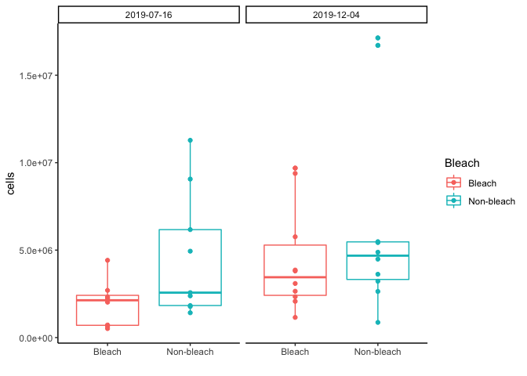
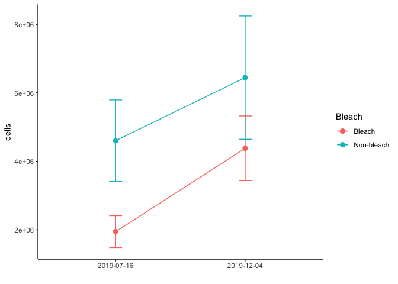

Endosymbiont Density (cell counts) Analysis
================
Author: Emma Strand; <emma_strand@uri.edu>

Load packages.

``` r
rm(list=ls())

library(plyr)
library(dplyr)
```

    ## 
    ## Attaching package: 'dplyr'

    ## The following objects are masked from 'package:plyr':
    ## 
    ##     arrange, count, desc, failwith, id, mutate, rename, summarise,
    ##     summarize

    ## The following objects are masked from 'package:stats':
    ## 
    ##     filter, lag

    ## The following objects are masked from 'package:base':
    ## 
    ##     intersect, setdiff, setequal, union

``` r
library(readxl)
library(tidyr)
library(tidyverse)
```

    ## ── Attaching packages ─────────────────────────────────────── tidyverse 1.3.1 ──

    ## ✔ ggplot2 3.3.6     ✔ purrr   0.3.4
    ## ✔ tibble  3.1.8     ✔ stringr 1.4.0
    ## ✔ readr   2.1.2     ✔ forcats 0.5.1

    ## ── Conflicts ────────────────────────────────────────── tidyverse_conflicts() ──
    ## ✖ dplyr::arrange()   masks plyr::arrange()
    ## ✖ purrr::compact()   masks plyr::compact()
    ## ✖ dplyr::count()     masks plyr::count()
    ## ✖ dplyr::failwith()  masks plyr::failwith()
    ## ✖ dplyr::filter()    masks stats::filter()
    ## ✖ dplyr::id()        masks plyr::id()
    ## ✖ dplyr::lag()       masks stats::lag()
    ## ✖ dplyr::mutate()    masks plyr::mutate()
    ## ✖ dplyr::rename()    masks plyr::rename()
    ## ✖ dplyr::summarise() masks plyr::summarise()
    ## ✖ dplyr::summarize() masks plyr::summarize()

``` r
library(ggpubr)
```

    ## 
    ## Attaching package: 'ggpubr'

    ## The following object is masked from 'package:plyr':
    ## 
    ##     mutate

``` r
library(purrr)
library(Rmisc)
```

    ## Loading required package: lattice

``` r
library(lme4)
```

    ## Loading required package: Matrix

    ## 
    ## Attaching package: 'Matrix'

    ## The following objects are masked from 'package:tidyr':
    ## 
    ##     expand, pack, unpack

``` r
library(car)
```

    ## Loading required package: carData

    ## 
    ## Attaching package: 'car'

    ## The following object is masked from 'package:purrr':
    ## 
    ##     some

    ## The following object is masked from 'package:dplyr':
    ## 
    ##     recode

``` r
library(sjPlot)
```

    ## Learn more about sjPlot with 'browseVignettes("sjPlot")'.

``` r
library(ggstatsplot)
```

    ## You can cite this package as:
    ##      Patil, I. (2021). Visualizations with statistical details: The 'ggstatsplot' approach.
    ##      Journal of Open Source Software, 6(61), 3167, doi:10.21105/joss.03167

``` r
library(emmeans)
library(Rmisc)
```

## Load in data

``` r
meta <- read_excel("Dec-July-2019-analysis/data/Physiology-URI-labwork.xlsx", sheet = "Master-ID-List")
data <- read_excel("Dec-July-2019-analysis/data/Physiology-URI-labwork.xlsx", sheet = "Counts")

df <- full_join(meta, data, by = c("ColonyID", "Date")) 
df$ColonyID <- as.character(df$ColonyID)
df$Date <- as.character(df$Date)
```

## Calculate mean cell count per sample

``` r
df <- df %>%
  gather("rep", "count", Count1, Count2, Count3, Count4, Count5, Count6) %>%
  dplyr::group_by(ColonyID, Date) %>%
  mutate(count_mean = mean(count),
         cells.mL = count_mean * 10000 / `Squares counted`,
         cells = cells.mL * `volume (mL)`) %>%
         #haemo.cells.cm2 = cells / surface.area.cm2)
  ungroup() %>%
  filter(!is.na(cells)) %>%
  select(ColonyID, Date, Bleach, `volume (mL)`, count_mean, cells.mL, cells) %>%
  distinct() %>%
  write_csv(., file = "Dec-July-2019-analysis/data/cell_counts.csv")

df2 <- summarySE(df, measurevar = c("cells"), groupvars = c("Date", "Bleach"))
```

## Visualize data

``` r
df %>%
  ggplot(., aes(x=Bleach, y=cells, color=Bleach)) + 
  theme_classic() + xlab("") +
  geom_boxplot() +
  geom_point() +
  facet_grid(~Date)
```

<!-- -->

``` r
df2 %>%
  ggplot(., aes(x=Date, y=cells, color=Bleach)) + 
  geom_errorbar(aes(ymin=cells-se, ymax=cells+se), size=0.5, width=.1) +
  theme_classic() + xlab("") + geom_point(size=2.5) +
  geom_line(aes(group = Bleach))
```

<!-- -->
