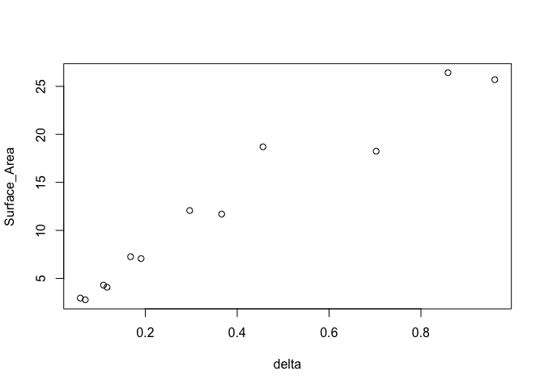
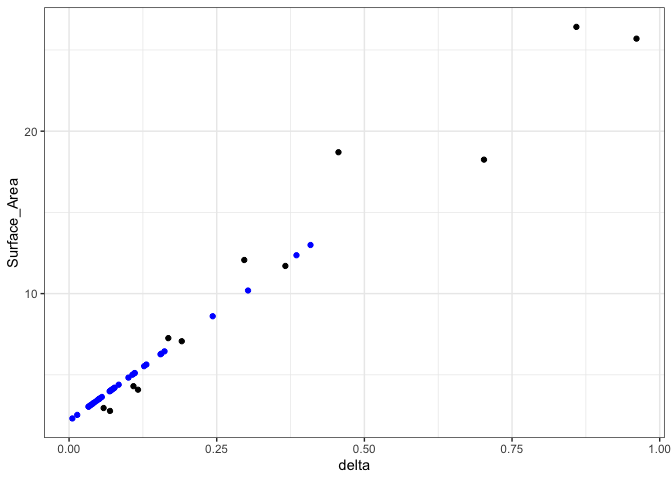
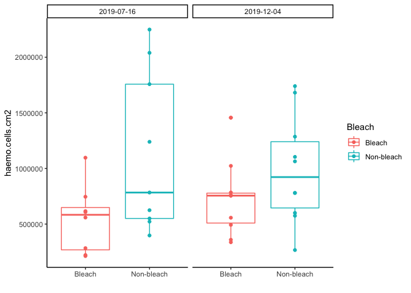
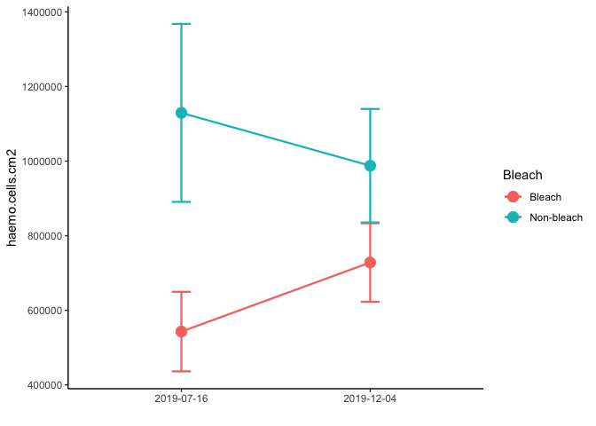
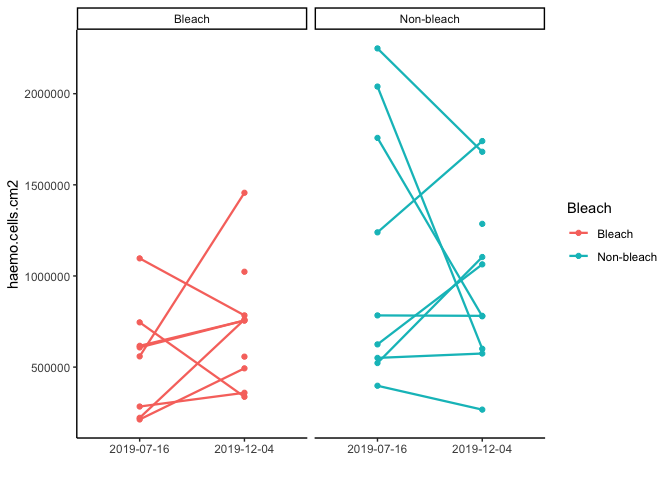

Endosymbiont Density (cell counts) Analysis
================
Author: Emma Strand; <emma_strand@uri.edu>

Load packages.

``` r
rm(list=ls())

library(plyr)
library(dplyr)
```

    ## 
    ## Attaching package: 'dplyr'

    ## The following objects are masked from 'package:plyr':
    ## 
    ##     arrange, count, desc, failwith, id, mutate, rename, summarise,
    ##     summarize

    ## The following objects are masked from 'package:stats':
    ## 
    ##     filter, lag

    ## The following objects are masked from 'package:base':
    ## 
    ##     intersect, setdiff, setequal, union

``` r
library(readxl)
library(tidyr)
library(tidyverse)
```

    ## ── Attaching packages ─────────────────────────────────────── tidyverse 1.3.1 ──

    ## ✔ ggplot2 3.3.6     ✔ purrr   0.3.4
    ## ✔ tibble  3.1.8     ✔ stringr 1.4.0
    ## ✔ readr   2.1.2     ✔ forcats 0.5.1

    ## ── Conflicts ────────────────────────────────────────── tidyverse_conflicts() ──
    ## ✖ dplyr::arrange()   masks plyr::arrange()
    ## ✖ purrr::compact()   masks plyr::compact()
    ## ✖ dplyr::count()     masks plyr::count()
    ## ✖ dplyr::failwith()  masks plyr::failwith()
    ## ✖ dplyr::filter()    masks stats::filter()
    ## ✖ dplyr::id()        masks plyr::id()
    ## ✖ dplyr::lag()       masks stats::lag()
    ## ✖ dplyr::mutate()    masks plyr::mutate()
    ## ✖ dplyr::rename()    masks plyr::rename()
    ## ✖ dplyr::summarise() masks plyr::summarise()
    ## ✖ dplyr::summarize() masks plyr::summarize()

``` r
library(ggpubr)
```

    ## 
    ## Attaching package: 'ggpubr'

    ## The following object is masked from 'package:plyr':
    ## 
    ##     mutate

``` r
library(purrr)
library(Rmisc)
```

    ## Loading required package: lattice

``` r
library(lme4)
```

    ## Loading required package: Matrix

    ## 
    ## Attaching package: 'Matrix'

    ## The following objects are masked from 'package:tidyr':
    ## 
    ##     expand, pack, unpack

``` r
library(car)
```

    ## Loading required package: carData

    ## 
    ## Attaching package: 'car'

    ## The following object is masked from 'package:purrr':
    ## 
    ##     some

    ## The following object is masked from 'package:dplyr':
    ## 
    ##     recode

``` r
library(sjPlot)
library(ggstatsplot)
```

    ## You can cite this package as:
    ##      Patil, I. (2021). Visualizations with statistical details: The 'ggstatsplot' approach.
    ##      Journal of Open Source Software, 6(61), 3167, doi:10.21105/joss.03167

``` r
library(emmeans)
library(Rmisc)
```

## Load in data

``` r
meta <- read_excel("Dec-July-2019-analysis/data/Physiology-URI-labwork.xlsx", sheet = "Master-ID-List")
data <- read_excel("Dec-July-2019-analysis/data/Physiology-URI-labwork.xlsx", sheet = "Counts")
sa <- read_excel("Dec-July-2019-analysis/data/Physiology-URI-labwork.xlsx", sheet = "Surface_area")

df <- full_join(meta, data, by = c("ColonyID", "Date")) 
df <- full_join(df, sa, by = c("ColonyID", "Date"))

df$ColonyID <- as.character(df$ColonyID)
df$Date <- as.character(df$Date)
```

## Calculate surface area

``` r
# Standard curve
st <- read_excel("Dec-July-2019-analysis/data/Wax_Dipping_Curve_091522.xlsx")
st$delta <- st$Wax_Weight-st$Weight1

stnd.curve <- lm(Surface_Area~delta, data=st)
plot(Surface_Area~delta, data=st)
```

<!-- -->

``` r
stnd.curve$coefficients
```

    ## (Intercept)       delta 
    ##    2.166292   26.482366

``` r
summary(stnd.curve) #R2 = 0.9448
```

    ## 
    ## Call:
    ## lm(formula = Surface_Area ~ delta, data = st)
    ## 
    ## Residuals:
    ##     Min      1Q  Median      3Q     Max 
    ## -2.5235 -1.1869 -0.4572  0.8595  4.4589 
    ## 
    ## Coefficients:
    ##             Estimate Std. Error t value Pr(>|t|)    
    ## (Intercept)   2.1663     0.9098   2.381   0.0385 *  
    ## delta        26.4824     1.9243  13.762 7.98e-08 ***
    ## ---
    ## Signif. codes:  0 '***' 0.001 '**' 0.01 '*' 0.05 '.' 0.1 ' ' 1
    ## 
    ## Residual standard error: 2.021 on 10 degrees of freedom
    ## Multiple R-squared:  0.9498, Adjusted R-squared:  0.9448 
    ## F-statistic: 189.4 on 1 and 10 DF,  p-value: 7.977e-08

``` r
# Calculate surface area
sa$delta <- sa$Weight2-sa$Weight1
df$SA <- stnd.curve$coefficients[2] * sa$delta + stnd.curve$coefficients[1]

ggplot(data=st, aes(x=delta, y=Surface_Area)) + theme_bw() +
  geom_point() +
  geom_point(data=df, aes(x=sa$delta, y=SA), color="blue")
```

    ## Warning: Removed 3 rows containing missing values (geom_point).

<!-- -->

## Calculate mean cell count per sample

``` r
df <- df %>%
  gather("rep", "count", Count1, Count2, Count3, Count4, Count5, Count6) %>%
  dplyr::group_by(ColonyID, Date) %>%
  mutate(count_mean = mean(count),
         cells.mL = count_mean * 10000 / `Squares counted`,
         cells = cells.mL * `volume (mL)`, 
         haemo.cells.cm2 = cells / SA) %>%
  ungroup() %>%
  filter(!is.na(cells)) %>%
  select(ColonyID, Date, Bleach, `volume (mL)`, count_mean, cells.mL, cells, haemo.cells.cm2, SA) %>%
  distinct() %>%
  write_csv(., file = "Dec-July-2019-analysis/data/cell_counts.csv")

df2 <- summarySE(df, measurevar = c("haemo.cells.cm2"), groupvars = c("Date", "Bleach"))
```

## Visualize data

``` r
df %>%
  ggplot(., aes(x=Bleach, y=haemo.cells.cm2, color=Bleach)) + 
  theme_classic() + xlab("") +
  geom_boxplot() +
  geom_point() +
  facet_grid(~Date)
```

<!-- -->

``` r
df2 %>%
  ggplot(., aes(x=Date, y=haemo.cells.cm2, color=Bleach)) + 
  geom_errorbar(aes(ymin=haemo.cells.cm2-se, ymax=haemo.cells.cm2+se), size=0.8, width=.1) +
  theme_classic() + xlab("") + geom_point(size=4) +
  geom_line(aes(group = Bleach), size=0.8)
```

<!-- -->

``` r
df %>%
  ggplot(., aes(x=Date, y=haemo.cells.cm2, color=Bleach)) +
  theme_classic() + xlab("") +
  geom_point() + geom_line(aes(group = ColonyID), size=0.8) +
  facet_grid(~Bleach)
```

<!-- -->
