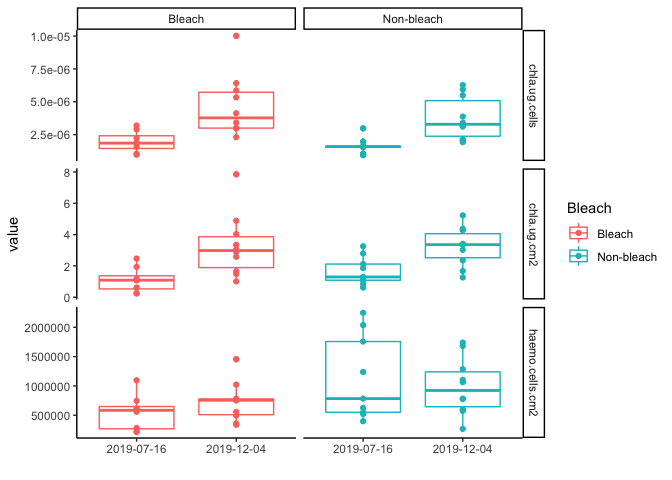
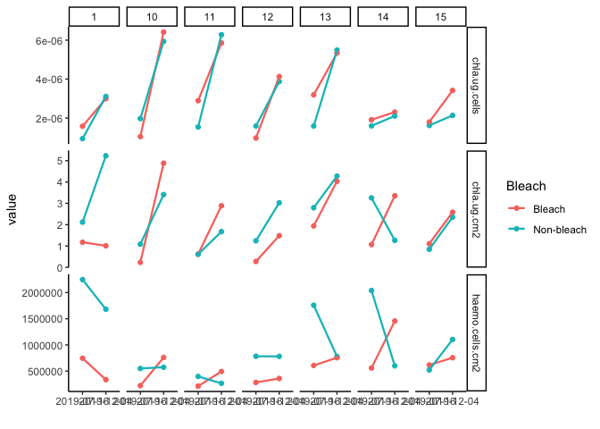

Chlorophyll Analysis
================
Author: Emma Strand; <emma_strand@uri.edu>

Load packages.

``` r
rm(list=ls())

library(plyr)
library(dplyr)
```

    ## 
    ## Attaching package: 'dplyr'

    ## The following objects are masked from 'package:plyr':
    ## 
    ##     arrange, count, desc, failwith, id, mutate, rename, summarise,
    ##     summarize

    ## The following objects are masked from 'package:stats':
    ## 
    ##     filter, lag

    ## The following objects are masked from 'package:base':
    ## 
    ##     intersect, setdiff, setequal, union

``` r
library(readxl)
library(tidyr)
library(tidyverse)
```

    ## ── Attaching packages ─────────────────────────────────────── tidyverse 1.3.1 ──

    ## ✔ ggplot2 3.3.6     ✔ purrr   0.3.4
    ## ✔ tibble  3.1.8     ✔ stringr 1.4.0
    ## ✔ readr   2.1.2     ✔ forcats 0.5.1

    ## ── Conflicts ────────────────────────────────────────── tidyverse_conflicts() ──
    ## ✖ dplyr::arrange()   masks plyr::arrange()
    ## ✖ purrr::compact()   masks plyr::compact()
    ## ✖ dplyr::count()     masks plyr::count()
    ## ✖ dplyr::failwith()  masks plyr::failwith()
    ## ✖ dplyr::filter()    masks stats::filter()
    ## ✖ dplyr::id()        masks plyr::id()
    ## ✖ dplyr::lag()       masks stats::lag()
    ## ✖ dplyr::mutate()    masks plyr::mutate()
    ## ✖ dplyr::rename()    masks plyr::rename()
    ## ✖ dplyr::summarise() masks plyr::summarise()
    ## ✖ dplyr::summarize() masks plyr::summarize()

``` r
library(ggpubr)
```

    ## 
    ## Attaching package: 'ggpubr'

    ## The following object is masked from 'package:plyr':
    ## 
    ##     mutate

``` r
library(purrr)
library(Rmisc)
```

    ## Loading required package: lattice

``` r
library(lme4)
```

    ## Loading required package: Matrix

    ## 
    ## Attaching package: 'Matrix'

    ## The following objects are masked from 'package:tidyr':
    ## 
    ##     expand, pack, unpack

``` r
library(car)
```

    ## Loading required package: carData

    ## 
    ## Attaching package: 'car'

    ## The following object is masked from 'package:purrr':
    ## 
    ##     some

    ## The following object is masked from 'package:dplyr':
    ## 
    ##     recode

``` r
library(sjPlot)
library(ggstatsplot)
```

    ## You can cite this package as:
    ##      Patil, I. (2021). Visualizations with statistical details: The 'ggstatsplot' approach.
    ##      Journal of Open Source Software, 6(61), 3167, doi:10.21105/joss.03167

``` r
library(emmeans)
library(Rmisc)
```

## Load in data and calculate cholorophyll concentrations

``` r
meta <- read_excel("Dec-July-2019-analysis/data/Physiology-URI-labwork.xlsx", sheet = "Master-ID-List")
meta$ColonyID <- as.character(meta$ColonyID)

cells <- read_csv("Dec-July-2019-analysis/data/cell_counts.csv") %>%
  select(ColonyID, Date, cells, haemo.cells.cm2, SA)
```

    ## Rows: 37 Columns: 9
    ## ── Column specification ────────────────────────────────────────────────────────
    ## Delimiter: ","
    ## chr  (1): Bleach
    ## dbl  (7): ColonyID, volume (mL), count_mean, cells.mL, cells, haemo.cells.cm...
    ## date (1): Date
    ## 
    ## ℹ Use `spec()` to retrieve the full column specification for this data.
    ## ℹ Specify the column types or set `show_col_types = FALSE` to quiet this message.

``` r
cells$ColonyID <- as.character(cells$ColonyID)

meta <- full_join(meta, cells, by = c("ColonyID", "Date")) 

platemap <- read_excel("Dec-July-2019-analysis/data/Physiology-URI-labwork.xlsx", 
                   sheet = "Chlorophyll", col_types = c("text", "text", "date"))
```

    ## Warning: Expecting date in C2 / R2C3: got 'NA'

    ## Warning: Expecting date in C9 / R9C3: got 'NA'

    ## Warning: Expecting date in C10 / R10C3: got 'NA'

    ## Warning: Expecting date in C17 / R17C3: got 'NA'

    ## Warning: Expecting date in C25 / R25C3: got 'NA'

    ## Warning: Expecting date in C33 / R33C3: got 'NA'

    ## Warning: Expecting date in C40 / R40C3: got 'NA'

    ## Warning: Expecting date in C41 / R41C3: got 'NA'

    ## Warning: Expecting date in C48 / R48C3: got 'NA'

    ## Warning: Expecting date in C49 / R49C3: got 'NA'

    ## Warning: Expecting date in C56 / R56C3: got 'NA'

    ## Warning: Expecting date in C57 / R57C3: got 'NA'

    ## Warning: Expecting date in C64 / R64C3: got 'NA'

    ## Warning: Expecting date in C65 / R65C3: got 'NA'

    ## Warning: Expecting date in C72 / R72C3: got 'NA'

    ## Warning: Expecting date in C73 / R73C3: got 'NA'

    ## Warning: Expecting date in C80 / R80C3: got 'NA'

    ## Warning: Expecting date in C81 / R81C3: got 'NA'

    ## Warning: Expecting date in C88 / R88C3: got 'NA'

    ## Warning: Expecting date in C89 / R89C3: got 'NA'

    ## Warning: Expecting date in C96 / R96C3: got 'NA'

    ## Warning: Expecting date in C97 / R97C3: got 'NA'

``` r
platemap$ColonyID[platemap$ColonyID == "NA"] <- NA

raw_data <-
  list.files(path = 'Dec-July-2019-analysis/data/chlorophyll',pattern = ".csv", full.names = TRUE) %>% 
  # list files in directory following a particular pattern
  set_names(.) %>% # get the column names
  map_dfr(read.csv, .id = "file.ID") %>% # join all files together in one data frame by file ID
  select(Well, Chl.663, Chl.750, Chl.630) %>%
  gather(absorbance, value, 2:4) %>%
  filter(!is.na(value)) %>%
  spread(absorbance, value)

df <- full_join(raw_data, platemap, by = "Well") %>%
  filter(!is.na(ColonyID)) %>%
  group_by(ColonyID, Date) %>%
  mutate(mean630 = mean(Chl.630),
         mean663 = mean(Chl.663),
         mean750 = mean(Chl.750)) %>%
  ungroup(ColonyID, Date) %>%
  select(ColonyID, Date, mean630, mean663, mean750) %>%
  distinct() %>%
# adjust sample values by subtracting the blank value 
# calculate chla and chlc2 values based on equations from Jeffrey and Humphrey 1975
  mutate(blank750 = `mean750`[ColonyID == "Blank"],
         adj630 = mean630 - blank750,
         adj663 = mean663 - blank750,
         chla.ug.ml = (11.43 * adj663) - (0.64 * adj630),
         chlc2.ug.ml = (27.09 * adj630) - (3.63 * adj663)) %>%
  select(ColonyID, Date, chla.ug.ml, chlc2.ug.ml) %>%
  filter(!is.na(Date)) 

df <- full_join(df, meta, by = c("ColonyID", "Date")) %>%
  mutate(chla.ug.cm2 = (chla.ug.ml * `volume (mL)`) / SA,
         chlc2.ug.cm2 = (chlc2.ug.ml * `volume (mL)`) / SA,
         chla.ug.cells = (chla.ug.ml * `volume (mL)`) / cells,
         chlc2.ug.cells = (chlc2.ug.ml * `volume (mL)`) / cells) %>%
  gather(measurement, value, 13:18) %>%
  filter(!is.na(value)) %>%
  subset(measurement == "chla.ug.cells" | 
           measurement == "chla.ug.cm2" | 
           measurement == "haemo.cells.cm2")

df$Date <- as.character(df$Date)

df2 <- summarySE(df, measurevar = c("value"), groupvars = c("Date", "Bleach", "measurement"))
```

## Figures

``` r
df %>%
  ggplot(., aes(x=Date, y=value, color=Bleach)) + 
  theme_classic() + xlab("") +
  geom_boxplot() + geom_point() +
  facet_grid(measurement~Bleach, scales = "free")
```

<!-- -->

``` r
df %>%
  subset(!Pair == "2" & !Pair == "3" & !Pair == "9") %>%
  #subset(!measurement == "chla.ug.cm2") %>%
  ggplot(., aes(x=Date, y=value, color=Bleach)) +
  theme_classic() + xlab("") +
  geom_point() + geom_line(aes(group = ColonyID), size=0.8) +
  facet_grid(measurement~Pair, scales = "free")
```

<!-- -->

``` r
df %>%
  ggplot(., aes(x=Date, y=value, color=Bleach)) +
  geom_point(alpha=0.2) +
  theme_classic() + xlab("") + ylab("") +
  geom_point(data = df2, aes(x=Date, y=value), size=3) +
  geom_errorbar(data = df2, aes(ymin=value-se, ymax=value+se), size=0.8, width=.1) +
  geom_line(data=df2, aes(group = Bleach), size=0.8) +
  facet_wrap(~measurement, scales = "free")
```

<!-- -->

``` r
df2 %>%
  ggplot(., aes(x=Date, y=value, color=Bleach)) + 
  theme_classic() + xlab("") + geom_point(size=4) +
  geom_errorbar(aes(ymin=value-se, ymax=value+se), size=0.8, width=.1) +
  geom_line(aes(group = Bleach), size=0.8) +
  facet_wrap(~measurement, scales = "free")
```

<!-- -->

## Relative Change

``` r
rel.change <- df %>% 
  select(ColonyID, Date, Site, Pair, Bleach, measurement, value) %>%
  pivot_wider(id_cols = c("ColonyID", "Site", "Pair", "Bleach"),
            names_from = c("measurement", "Date"),
            values_from = value) %>%
  mutate(density_change = `haemo.cells.cm2_2019-12-04`-`haemo.cells.cm2_2019-07-16`,
         chlcm2_change = `chla.ug.cm2_2019-12-04` - `chla.ug.cm2_2019-07-16`,
         chlcell_change = `chla.ug.cells_2019-12-04` - `chla.ug.cells_2019-07-16`) %>%
  select(ColonyID, Site, Pair, Bleach, density_change, chlcm2_change, chlcell_change) %>%
  na.omit() %>%
  gather(measurement, value, 5:7)

rel.change %>%
  ggplot(., aes(x=Bleach, y=value, color=Bleach)) + 
  geom_boxplot() + geom_point() +
  ylab("Relative change") +
  geom_hline(yintercept = 0, lty = "dotted", size=1.2, color="grey2") +
  theme_classic() + facet_wrap(~measurement, scales = "free")
```

<!-- -->

``` r
rel.change2 <- summarySE(rel.change, measurevar = c("value"), groupvars = c("Bleach", "measurement"))

rel.change %>% 
  ggplot(., aes(x=Bleach, y=value, color=Bleach)) + 
  geom_point(alpha=0.2) +
  geom_point(data = rel.change2, aes(x=Bleach, y=value), size=3) +
  geom_errorbar(data = rel.change2, aes(ymin=value-se, ymax=value+se), size=0.5, width=.1) +
  theme_classic() + xlab("") + 
  ylab("Relative change") +
  geom_hline(yintercept = 0, lty = "dotted", size=1.2, color="grey2") +
  facet_wrap(~measurement, scales = "free")
```

<!-- -->

## Statistics

### Chlorophyll per cell

``` r
df_stats <- df %>%
  spread(measurement, value)
  
CHLcells_model <- lmer(chla.ug.cells~Date*Bleach + (1|Pair/ColonyID), data=df_stats) 
```

    ## boundary (singular) fit: see help('isSingular')

``` r
  # boundary (singular) fit: see help('isSingular')
summary(CHLcells_model)
```

    ## Linear mixed model fit by REML ['lmerMod']
    ## Formula: chla.ug.cells ~ Date * Bleach + (1 | Pair/ColonyID)
    ##    Data: df_stats
    ## 
    ## REML criterion at convergence: -782.1
    ## 
    ## Scaled residuals: 
    ##     Min      1Q  Median      3Q     Max 
    ## -1.2969 -0.6551 -0.1051  0.3234  3.2961 
    ## 
    ## Random effects:
    ##  Groups        Name        Variance  Std.Dev. 
    ##  ColonyID:Pair (Intercept) 0.000e+00 0.000e+00
    ##  Pair          (Intercept) 6.360e-13 7.975e-07
    ##  Residual                  1.819e-12 1.349e-06
    ## Number of obs: 37, groups:  ColonyID:Pair, 20; Pair, 10
    ## 
    ## Fixed effects:
    ##                                   Estimate Std. Error t value
    ## (Intercept)                      1.844e-06  5.466e-07   3.373
    ## Date2019-12-04                   2.802e-06  6.458e-07   4.339
    ## BleachNon-bleach                -8.945e-08  6.654e-07  -0.134
    ## Date2019-12-04:BleachNon-bleach -8.146e-07  8.981e-07  -0.907
    ## 
    ## Correlation of Fixed Effects:
    ##              (Intr) Dt2019-12-04 BlchN-
    ## Dt2019-12-04 -0.666                    
    ## BlchNn-blch  -0.649  0.550             
    ## D2019-12-04:  0.481 -0.721       -0.741
    ## optimizer (nloptwrap) convergence code: 0 (OK)
    ## boundary (singular) fit: see help('isSingular')

``` r
qqPlot(residuals(CHLcells_model))
```

<!-- -->

    ## [1] 29 17

``` r
leveneTest(residuals(CHLcells_model)~Date*Bleach, data=df_stats)
```

    ## Levene's Test for Homogeneity of Variance (center = median)
    ##       Df F value Pr(>F)
    ## group  3  1.4879 0.2358
    ##       33

``` r
Anova(CHLcells_model, ddf="lme4", type='III')
```

    ## Analysis of Deviance Table (Type III Wald chisquare tests)
    ## 
    ## Response: chla.ug.cells
    ##               Chisq Df Pr(>Chisq)    
    ## (Intercept) 11.3785  1   0.000743 ***
    ## Date        18.8288  1   1.43e-05 ***
    ## Bleach       0.0181  1   0.893057    
    ## Date:Bleach  0.8228  1   0.364372    
    ## ---
    ## Signif. codes:  0 '***' 0.001 '**' 0.01 '*' 0.05 '.' 0.1 ' ' 1

### Chlorophyll per cm2

``` r
CHLcm2_model <- lmer(chla.ug.cm2~Date*Bleach + (1|Pair/ColonyID), data=df_stats) 
summary(CHLcm2_model)
```

    ## Linear mixed model fit by REML ['lmerMod']
    ## Formula: chla.ug.cm2 ~ Date * Bleach + (1 | Pair/ColonyID)
    ##    Data: df_stats
    ## 
    ## REML criterion at convergence: 119.7
    ## 
    ## Scaled residuals: 
    ##      Min       1Q   Median       3Q      Max 
    ## -1.93394 -0.39834  0.05946  0.24544  2.79774 
    ## 
    ## Random effects:
    ##  Groups        Name        Variance Std.Dev.
    ##  ColonyID:Pair (Intercept) 0.08183  0.2861  
    ##  Pair          (Intercept) 0.51020  0.7143  
    ##  Residual                  1.25788  1.1216  
    ## Number of obs: 37, groups:  ColonyID:Pair, 20; Pair, 10
    ## 
    ## Fixed effects:
    ##                                 Estimate Std. Error t value
    ## (Intercept)                       1.0531     0.4730   2.226
    ## Date2019-12-04                    2.2292     0.5388   4.137
    ## BleachNon-bleach                  0.7615     0.5704   1.335
    ## Date2019-12-04:BleachNon-bleach  -0.8113     0.7487  -1.084
    ## 
    ## Correlation of Fixed Effects:
    ##              (Intr) Dt2019-12-04 BlchN-
    ## Dt2019-12-04 -0.646                    
    ## BlchNn-blch  -0.643  0.538             
    ## D2019-12-04:  0.467 -0.721       -0.723

``` r
qqPlot(residuals(CHLcm2_model))
```

<!-- -->

    ## [1] 29 12

``` r
leveneTest(residuals(CHLcm2_model)~Date*Bleach, data=df_stats)
```

    ## Levene's Test for Homogeneity of Variance (center = median)
    ##       Df F value Pr(>F)
    ## group  3  1.8693  0.154
    ##       33

``` r
Anova(CHLcm2_model, ddf="lme4", type='III')
```

    ## Analysis of Deviance Table (Type III Wald chisquare tests)
    ## 
    ## Response: chla.ug.cm2
    ##               Chisq Df Pr(>Chisq)    
    ## (Intercept)  4.9570  1    0.02598 *  
    ## Date        17.1161  1  3.516e-05 ***
    ## Bleach       1.7824  1    0.18186    
    ## Date:Bleach  1.1744  1    0.27850    
    ## ---
    ## Signif. codes:  0 '***' 0.001 '**' 0.01 '*' 0.05 '.' 0.1 ' ' 1

### Cell density

``` r
cells_model <- lmer(haemo.cells.cm2~Date*Bleach + (1|Pair/ColonyID), data=df_stats) 
summary(cells_model)
```

    ## Linear mixed model fit by REML ['lmerMod']
    ## Formula: haemo.cells.cm2 ~ Date * Bleach + (1 | Pair/ColonyID)
    ##    Data: df_stats
    ## 
    ## REML criterion at convergence: 964.5
    ## 
    ## Scaled residuals: 
    ##      Min       1Q   Median       3Q      Max 
    ## -1.36584 -0.47149 -0.08893  0.43328  1.82845 
    ## 
    ## Random effects:
    ##  Groups        Name        Variance  Std.Dev.
    ##  ColonyID:Pair (Intercept) 2.930e+10 171175  
    ##  Pair          (Intercept) 4.210e+10 205186  
    ##  Residual                  1.637e+11 404573  
    ## Number of obs: 37, groups:  ColonyID:Pair, 20; Pair, 10
    ## 
    ## Fixed effects:
    ##                                 Estimate Std. Error t value
    ## (Intercept)                       552214     169402   3.260
    ## Date2019-12-04                    176017     194743   0.904
    ## BleachNon-bleach                  592620     214958   2.757
    ## Date2019-12-04:BleachNon-bleach  -333183     270338  -1.232
    ## 
    ## Correlation of Fixed Effects:
    ##              (Intr) Dt2019-12-04 BlchN-
    ## Dt2019-12-04 -0.653                    
    ## BlchNn-blch  -0.674  0.516             
    ## D2019-12-04:  0.472 -0.721       -0.694

``` r
qqPlot(residuals(cells_model))
```

<!-- -->

    ## [1] 4 6

``` r
leveneTest(residuals(cells_model)~Date*Bleach, data=df_stats)
```

    ## Levene's Test for Homogeneity of Variance (center = median)
    ##       Df F value Pr(>F)
    ## group  3  2.1525 0.1124
    ##       33

``` r
Anova(cells_model, ddf="lme4", type='III')
```

    ## Analysis of Deviance Table (Type III Wald chisquare tests)
    ## 
    ## Response: haemo.cells.cm2
    ##               Chisq Df Pr(>Chisq)   
    ## (Intercept) 10.6262  1   0.001115 **
    ## Date         0.8169  1   0.366077   
    ## Bleach       7.6006  1   0.005835 **
    ## Date:Bleach  1.5190  1   0.217774   
    ## ---
    ## Signif. codes:  0 '***' 0.001 '**' 0.01 '*' 0.05 '.' 0.1 ' ' 1
