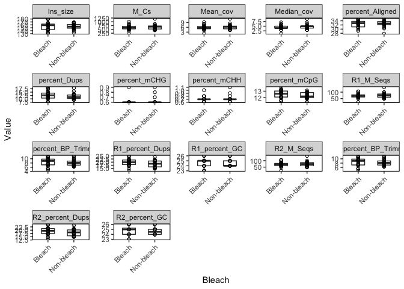
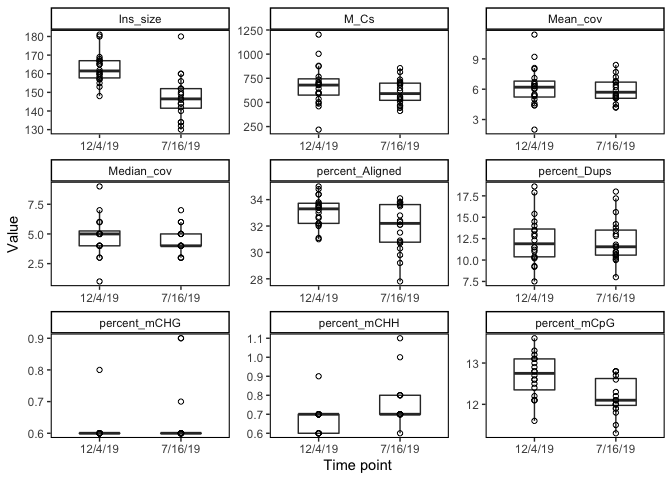
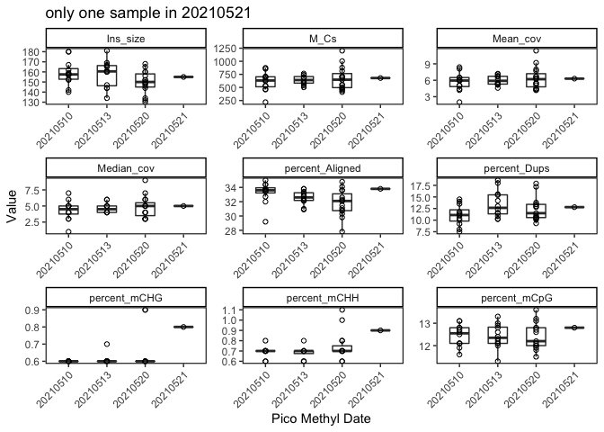
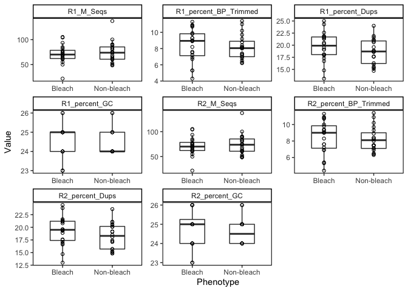
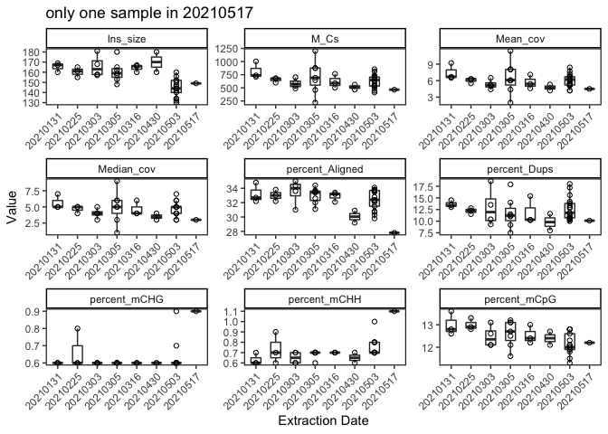

Methylseq statistics
================
EL Strand

Based on Kevin Wong’s methylseq analysis scripts.

``` r
# Read in required libraries
library("reshape")
#library(plyr)
library("dplyr")
library("tidyverse")
library("Rmisc")
library(gridExtra)
library(ggpubr)
library(tidyverse)
library(ggplot2)
library(RColorBrewer)
library(lme4)
library(lmerTest)
library(car)
library(effects)
library(ggfortify)
library(cowplot)
library(vegan)
library(corrr)
library(ggcorrplot)
library(GGally)
library(broom)
library(cowplot)
library(arsenal)
library(patchwork)
library(tidyr)
library(ggrepel)
```

Read in data

``` r
# load data
data <- read.csv("Dec-July-2019-analysis/output/WGBS/methylseq_stats.csv") %>% na.omit()

# Removing characters in columns and turning the values numeric
data$percent_Aligned <- as.numeric(sub("%","",data$percent_Aligned))
data$percent_Dups <- as.numeric(sub("%","",data$percent_Dups))
data$percent_Aligned <- as.numeric(sub("%","",data$percent_Aligned))
data$percent_mCHG <- as.numeric(sub("%","",data$percent_mCHG))
data$percent_mCHH <- as.numeric(sub("%","",data$percent_mCHH))
data$percent_mCpG <- as.numeric(sub("%","",data$percent_mCpG))
data$R1_percent_BP_Trimmed <- as.numeric(sub("%","",data$R1_percent_BP_Trimmed))
data$R1_percent_Dups <- as.numeric(sub("%","",data$R1_percent_Dups))
data$R1_percent_GC <- as.numeric(sub("%","",data$R1_percent_GC))
data$R2_percent_BP_Trimmed <- as.numeric(sub("%","",data$R2_percent_BP_Trimmed))
data$R2_percent_Dups <- as.numeric(sub("%","",data$R2_percent_Dups))
data$R2_percent_GC <- as.numeric(sub("%","",data$R2_percent_GC))

data$Mean_cov <- as.numeric(sub("X","",data$Mean_cov))
data$Median_cov <- as.numeric(sub("X","",data$Median_cov))

data$EXT_Date <- as.character(data$EXT_Date)
data$PMS_Date <- as.character(data$PMS_Date)
```

Plotting

``` r
data %>% select(1:19) %>%
  gather(measurement, value, 11:19) %>%
  ggplot(., aes(x=Bleach, y=value)) +
  geom_boxplot(width=.5, outlier.shape= NA, position = position_dodge(width = 0.5), alpha = 0.7) +
  geom_point(pch = 21) +
  xlab("Phenotype") +  
  ylab("Value") + #Axis titles
  theme_classic() + 
  theme(panel.border = element_rect(color="black", fill=NA, size=0.75), 
        panel.grid.major = element_blank(), #Makes background theme white
        panel.grid.minor = element_blank(), 
        axis.line = element_blank()) +
  facet_wrap(~ measurement, scales = "free")
```

<!-- -->

``` r
data %>% select(1:19) %>%
  gather(measurement, value, 11:19) %>%
  ggplot(., aes(x=Date, y=value)) +
  geom_boxplot(width=.5, outlier.shape= NA, position = position_dodge(width = 0.5), alpha = 0.7) +
  geom_point(pch = 21) +
  xlab("Time point") +  
  ylab("Value") + #Axis titles
  theme_classic() + 
  theme(panel.border = element_rect(color="black", fill=NA, size=0.75), 
        panel.grid.major = element_blank(), #Makes background theme white
        panel.grid.minor = element_blank(), 
        axis.line = element_blank()) +
  facet_wrap(~ measurement, scales = "free")
```

<!-- -->

``` r
data %>% select(1:19) %>%
  gather(measurement, value, 11:19) %>%
  ggplot(., aes(x=EXT_Date, y=value)) +
  geom_boxplot(width=.5, outlier.shape= NA, position = position_dodge(width = 0.5), alpha = 0.7) +
  geom_point(pch = 21) +
  xlab("Extraction Date") +  
  ylab("Value") + #Axis titles
  theme_classic() + 
  ggtitle("only one sample in 20210517") +
  theme(panel.border = element_rect(color="black", fill=NA, size=0.75), 
        panel.grid.major = element_blank(), #Makes background theme white
        panel.grid.minor = element_blank(), 
        axis.line = element_blank(),
        axis.text.x = element_text(angle = 45, hjust = 1)) +
  facet_wrap(~ measurement, scales = "free")
```

<!-- -->

``` r
data %>% select(1:19) %>%
  gather(measurement, value, 11:19) %>%
  ggplot(., aes(x=PMS_Date, y=value)) +
  geom_boxplot(width=.5, outlier.shape= NA, position = position_dodge(width = 0.5), alpha = 0.7) +
  geom_point(pch = 21) +
  ggtitle("only one sample in 20210521") +
  xlab("Pico Methyl Date") +  
  ylab("Value") + #Axis titles
  theme_classic() + 
  theme(panel.border = element_rect(color="black", fill=NA, size=0.75), 
        panel.grid.major = element_blank(), #Makes background theme white
        panel.grid.minor = element_blank(), 
        axis.line = element_blank(),
        axis.text.x = element_text(angle = 45, hjust = 1)) +
  facet_wrap(~ measurement, scales = "free")
```

<!-- -->

``` r
data %>% select(1:10, 20:27) %>%
  gather(measurement, value, 11:18) %>%
  ggplot(., aes(x=Bleach, y=value)) +
  geom_boxplot(width=.5, outlier.shape= NA, position = position_dodge(width = 0.5), alpha = 0.7) +
  geom_point(pch = 21) +
  xlab("Phenotype") +  
  ylab("Value") + #Axis titles
  theme_classic() + 
  theme(panel.border = element_rect(color="black", fill=NA, size=0.75), 
        panel.grid.major = element_blank(), #Makes background theme white
        panel.grid.minor = element_blank(), 
        axis.line = element_blank()) +
  facet_wrap(~ measurement, scales = "free")
```

<!-- -->

``` r
data %>% select(1:10, 20:27) %>%
  gather(measurement, value, 11:18) %>%
  ggplot(., aes(x=Date, y=value)) +
  geom_boxplot(width=.5, outlier.shape= NA, position = position_dodge(width = 0.5), alpha = 0.7) +
  geom_point(pch = 21) +
  xlab("Time point") +  
  ylab("Value") + #Axis titles
  theme_classic() + 
  theme(panel.border = element_rect(color="black", fill=NA, size=0.75), 
        panel.grid.major = element_blank(), #Makes background theme white
        panel.grid.minor = element_blank(), 
        axis.line = element_blank()) +
  facet_wrap(~ measurement, scales = "free")
```

<!-- -->

``` r
data %>% select(1:10, 20:27) %>%
  gather(measurement, value, 11:18) %>%
  ggplot(., aes(x=EXT_Date, y=value)) +
  geom_boxplot(width=.5, outlier.shape= NA, position = position_dodge(width = 0.5), alpha = 0.7) +
  geom_point(pch = 21) +
  xlab("Extraction Date") +  
  ylab("Value") + #Axis titles
  theme_classic() + 
  ggtitle("only one sample in 20210517") +
  theme(panel.border = element_rect(color="black", fill=NA, size=0.75), 
        panel.grid.major = element_blank(), #Makes background theme white
        panel.grid.minor = element_blank(), 
        axis.line = element_blank(),
        axis.text.x = element_text(angle = 45, hjust = 1)) +
  facet_wrap(~ measurement, scales = "free")
```

<!-- -->

``` r
data %>% select(1:10, 20:27) %>%
  gather(measurement, value, 11:18) %>%
  ggplot(., aes(x=PMS_Date, y=value)) +
  geom_boxplot(width=.5, outlier.shape= NA, position = position_dodge(width = 0.5), alpha = 0.7) +
  geom_point(pch = 21) +
  ggtitle("only one sample in 20210521") +
  xlab("Pico Methyl Date") +  
  ylab("Value") + #Axis titles
  theme_classic() + 
  theme(panel.border = element_rect(color="black", fill=NA, size=0.75), 
        panel.grid.major = element_blank(), #Makes background theme white
        panel.grid.minor = element_blank(), 
        axis.line = element_blank(),
        axis.text.x = element_text(angle = 45, hjust = 1)) +
  facet_wrap(~ measurement, scales = "free")
```

<!-- -->

Statistics

``` r
data2 <- data %>% unite(Group, Bleach, Date, sep = " ") %>%
  select(7, 10:26)

tableby_Group <- tableby(Group ~., data = data2)
```

|                          | Bleach 12/4/19 (N=10) | Bleach 7/16/19 (N=10) | Non-bleach 12/4/19 (N=10) | Non-bleach 7/16/19 (N=10) | Total (N=40)       | p value    |
|--------------------------|-----------------------|-----------------------|---------------------------|---------------------------|--------------------|------------|
| percent\_mCpG            |                       |                       |                           |                           |                    | 0.007      |
| Mean (SD)                | 12.820 (0.603)        | 12.290 (0.428)        | 12.560 (0.353)            | 12.080 (0.449)            | 12.438 (0.530)     |            |
| Range                    | 11.600 - 13.600       | 11.500 - 12.800       | 12.100 - 13.100           | 11.300 - 12.800           | 11.300 - 13.600    |            |
| percent\_mCHG            |                       |                       |                           |                           |                    | 0.670      |
| Mean (SD)                | 0.600 (0.000)         | 0.630 (0.095)         | 0.620 (0.063)             | 0.640 (0.097)             | 0.622 (0.073)      |            |
| Range                    | 0.600 - 0.600         | 0.600 - 0.900         | 0.600 - 0.800             | 0.600 - 0.900             | 0.600 - 0.900      |            |
| percent\_mCHH            |                       |                       |                           |                           |                    | 0.165      |
| Mean (SD)                | 0.670 (0.048)         | 0.750 (0.108)         | 0.690 (0.088)             | 0.750 (0.127)             | 0.715 (0.100)      |            |
| Range                    | 0.600 - 0.700         | 0.600 - 1.000         | 0.600 - 0.900             | 0.700 - 1.100             | 0.600 - 1.100      |            |
| M\_Cs                    |                       |                       |                           |                           |                    | 0.297      |
| Mean (SD)                | 696.070 (218.093)     | 554.080 (85.137)      | 660.170 (212.230)         | 663.370 (139.478)         | 643.423 (174.539)  |            |
| Range                    | 218.300 - 1003.600    | 411.500 - 698.100     | 459.800 - 1202.100        | 442.600 - 855.300         | 218.300 - 1202.100 |            |
| percent\_Dups            |                       |                       |                           |                           |                    | 0.280      |
| Mean (SD)                | 13.520 (3.376)        | 12.070 (2.592)        | 11.230 (1.517)            | 12.430 (2.590)            | 12.312 (2.637)     |            |
| Range                    | 7.500 - 18.600        | 8.000 - 17.200        | 9.200 - 13.500            | 10.100 - 18.000           | 7.500 - 18.600     |            |
| percent\_Aligned         |                       |                       |                           |                           |                    | 0.146      |
| Mean (SD)                | 33.050 (1.353)        | 31.950 (1.728)        | 33.160 (0.909)            | 31.950 (1.933)            | 32.528 (1.584)     |            |
| Range                    | 31.000 - 34.800       | 29.200 - 33.800       | 32.100 - 35.000           | 27.800 - 34.100           | 27.800 - 35.000    |            |
| Ins\_size                |                       |                       |                           |                           |                    | &lt; 0.001 |
| Mean (SD)                | 165.100 (8.647)       | 146.400 (14.931)      | 160.700 (7.288)           | 148.400 (7.604)           | 155.150 (12.606)   |            |
| Range                    | 157.000 - 181.000     | 130.000 - 180.000     | 148.000 - 169.000         | 134.000 - 160.000         | 130.000 - 181.000  |            |
| Median\_cov              |                       |                       |                           |                           |                    | 0.431      |
| Mean (SD)                | 4.900 (1.663)         | 4.000 (0.667)         | 4.700 (1.703)             | 4.900 (1.287)             | 4.625 (1.390)      |            |
| Range                    | 1.000 - 7.000         | 3.000 - 5.000         | 3.000 - 9.000             | 3.000 - 7.000             | 1.000 - 9.000      |            |
| Mean\_cov                |                       |                       |                           |                           |                    | 0.473      |
| Mean (SD)                | 6.360 (2.011)         | 5.360 (0.792)         | 6.120 (2.042)             | 6.380 (1.356)             | 6.055 (1.625)      |            |
| Range                    | 2.000 - 9.200         | 4.200 - 6.700         | 4.400 - 11.400            | 4.200 - 8.400             | 2.000 - 11.400     |            |
| R1\_percent\_BP\_Trimmed |                       |                       |                           |                           |                    | 0.197      |
| Mean (SD)                | 7.590 (1.550)         | 9.200 (2.161)         | 7.930 (1.081)             | 8.360 (1.888)             | 8.270 (1.760)      |            |
| Range                    | 5.300 - 9.800         | 4.300 - 11.300        | 6.300 - 9.700             | 6.200 - 11.400            | 4.300 - 11.400     |            |
| R1\_percent\_Dups        |                       |                       |                           |                           |                    | 0.187      |
| Mean (SD)                | 20.840 (3.461)        | 18.610 (2.001)        | 18.310 (2.419)            | 19.080 (2.923)            | 19.210 (2.828)     |            |
| Range                    | 13.100 - 25.000       | 14.800 - 21.500       | 15.400 - 21.600           | 14.700 - 24.000           | 13.100 - 25.000    |            |
| R1\_percent\_GC          |                       |                       |                           |                           |                    | 0.264      |
| Mean (SD)                | 24.200 (0.789)        | 24.900 (0.876)        | 24.500 (0.527)            | 24.500 (0.850)            | 24.525 (0.784)     |            |
| Range                    | 23.000 - 25.000       | 23.000 - 26.000       | 24.000 - 25.000           | 24.000 - 26.000           | 23.000 - 26.000    |            |
| R1\_M\_Seqs              |                       |                       |                           |                           |                    | 0.553      |
| Mean (SD)                | 75.880 (24.704)       | 66.430 (8.924)        | 70.900 (25.854)           | 78.460 (15.890)           | 72.918 (19.842)    |            |
| Range                    | 21.800 - 105.400      | 49.900 - 82.400       | 48.400 - 137.500          | 50.300 - 100.200          | 21.800 - 137.500   |            |
| R2\_percent\_BP\_Trimmed |                       |                       |                           |                           |                    | 0.186      |
| Mean (SD)                | 7.640 (1.525)         | 9.250 (2.138)         | 8.000 (1.086)             | 8.430 (1.811)             | 8.330 (1.729)      |            |
| Range                    | 5.300 - 9.800         | 4.400 - 11.300        | 6.300 - 9.700             | 6.400 - 11.400            | 4.400 - 11.400     |            |
| R2\_percent\_Dups        |                       |                       |                           |                           |                    | 0.219      |
| Mean (SD)                | 20.230 (3.355)        | 18.330 (1.972)        | 17.800 (2.357)            | 18.690 (2.740)            | 18.762 (2.711)     |            |
| Range                    | 13.000 - 24.400       | 14.700 - 21.200       | 15.100 - 21.000           | 14.800 - 23.600           | 13.000 - 24.400    |            |
| R2\_percent\_GC          |                       |                       |                           |                           |                    | 0.279      |
| Mean (SD)                | 24.400 (0.843)        | 25.100 (0.994)        | 24.600 (0.516)            | 24.600 (0.843)            | 24.675 (0.829)     |            |
| Range                    | 23.000 - 26.000       | 23.000 - 26.000       | 24.000 - 25.000           | 24.000 - 26.000           | 23.000 - 26.000    |            |
| R2\_M\_Seqs              |                       |                       |                           |                           |                    | 0.553      |
| Mean (SD)                | 75.880 (24.704)       | 66.430 (8.924)        | 70.900 (25.854)           | 78.460 (15.890)           | 72.918 (19.842)    |            |
| Range                    | 21.800 - 105.400      | 49.900 - 82.400       | 48.400 - 137.500          | 50.300 - 100.200          | 21.800 - 137.500   |            |
