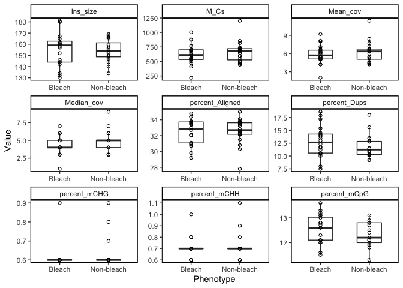

Methylseq statistics
================
EL Strand

Based on Kevin Wong’s methylseq analysis scripts.

``` r
# Read in required libraries
library("reshape")
#library(plyr)
library("dplyr")
```

    ## 
    ## Attaching package: 'dplyr'

    ## The following object is masked from 'package:reshape':
    ## 
    ##     rename

    ## The following objects are masked from 'package:stats':
    ## 
    ##     filter, lag

    ## The following objects are masked from 'package:base':
    ## 
    ##     intersect, setdiff, setequal, union

``` r
library("tidyverse")
```

    ## ── Attaching packages ─────────────────────────────────────── tidyverse 1.3.1 ──

    ## ✔ ggplot2 3.3.6     ✔ purrr   0.3.4
    ## ✔ tibble  3.1.7     ✔ stringr 1.4.0
    ## ✔ tidyr   1.2.0     ✔ forcats 0.5.1
    ## ✔ readr   2.1.2

    ## ── Conflicts ────────────────────────────────────────── tidyverse_conflicts() ──
    ## ✖ tidyr::expand() masks reshape::expand()
    ## ✖ dplyr::filter() masks stats::filter()
    ## ✖ dplyr::lag()    masks stats::lag()
    ## ✖ dplyr::rename() masks reshape::rename()

``` r
library("Rmisc")
```

    ## Loading required package: lattice

    ## Loading required package: plyr

    ## ------------------------------------------------------------------------------

    ## You have loaded plyr after dplyr - this is likely to cause problems.
    ## If you need functions from both plyr and dplyr, please load plyr first, then dplyr:
    ## library(plyr); library(dplyr)

    ## ------------------------------------------------------------------------------

    ## 
    ## Attaching package: 'plyr'

    ## The following object is masked from 'package:purrr':
    ## 
    ##     compact

    ## The following objects are masked from 'package:dplyr':
    ## 
    ##     arrange, count, desc, failwith, id, mutate, rename, summarise,
    ##     summarize

    ## The following objects are masked from 'package:reshape':
    ## 
    ##     rename, round_any

``` r
library(gridExtra)
```

    ## 
    ## Attaching package: 'gridExtra'

    ## The following object is masked from 'package:dplyr':
    ## 
    ##     combine

``` r
library(ggpubr)
```

    ## 
    ## Attaching package: 'ggpubr'

    ## The following object is masked from 'package:plyr':
    ## 
    ##     mutate

``` r
library(tidyverse)
library(ggplot2)
library(RColorBrewer)
library(lme4)
```

    ## Loading required package: Matrix

    ## 
    ## Attaching package: 'Matrix'

    ## The following objects are masked from 'package:tidyr':
    ## 
    ##     expand, pack, unpack

    ## The following object is masked from 'package:reshape':
    ## 
    ##     expand

``` r
library(lmerTest)
```

    ## 
    ## Attaching package: 'lmerTest'

    ## The following object is masked from 'package:lme4':
    ## 
    ##     lmer

    ## The following object is masked from 'package:stats':
    ## 
    ##     step

``` r
library(car)
```

    ## Loading required package: carData

    ## 
    ## Attaching package: 'car'

    ## The following object is masked from 'package:purrr':
    ## 
    ##     some

    ## The following object is masked from 'package:dplyr':
    ## 
    ##     recode

``` r
library(effects)
```

    ## Use the command
    ##     lattice::trellis.par.set(effectsTheme())
    ##   to customize lattice options for effects plots.
    ## See ?effectsTheme for details.

``` r
library(ggfortify)
library(cowplot)
```

    ## 
    ## Attaching package: 'cowplot'

    ## The following object is masked from 'package:ggpubr':
    ## 
    ##     get_legend

    ## The following object is masked from 'package:reshape':
    ## 
    ##     stamp

``` r
library(vegan)
```

    ## Loading required package: permute

    ## This is vegan 2.6-2

``` r
library(corrr)
library(ggcorrplot)
library(GGally)
```

    ## Registered S3 method overwritten by 'GGally':
    ##   method from   
    ##   +.gg   ggplot2

``` r
library(broom)
library(cowplot)
library(arsenal)
library(patchwork)
```

    ## 
    ## Attaching package: 'patchwork'

    ## The following object is masked from 'package:cowplot':
    ## 
    ##     align_plots

``` r
library(tidyr)
library(ggrepel)
```

Read in data

``` r
# load data
data <- read.csv("Dec-July-2019-analysis/output/WGBS/methylseq_stats.csv") %>% na.omit()

# Removing characters in columns and turning the values numeric
data$percent_Aligned <- as.numeric(sub("%","",data$percent_Aligned))
data$percent_Dups <- as.numeric(sub("%","",data$percent_Dups))
data$percent_Aligned <- as.numeric(sub("%","",data$percent_Aligned))
data$percent_mCHG <- as.numeric(sub("%","",data$percent_mCHG))
data$percent_mCHH <- as.numeric(sub("%","",data$percent_mCHH))
data$percent_mCpG <- as.numeric(sub("%","",data$percent_mCpG))
data$R1_percent_BP_Trimmed <- as.numeric(sub("%","",data$R1_percent_BP_Trimmed))
data$R1_percent_Dups <- as.numeric(sub("%","",data$R1_percent_Dups))
data$R1_percent_GC <- as.numeric(sub("%","",data$R1_percent_GC))
data$R2_percent_BP_Trimmed <- as.numeric(sub("%","",data$R2_percent_BP_Trimmed))
data$R2_percent_Dups <- as.numeric(sub("%","",data$R2_percent_Dups))
data$R2_percent_GC <- as.numeric(sub("%","",data$R2_percent_GC))

data$Mean_cov <- as.numeric(sub("X","",data$Mean_cov))
data$Median_cov <- as.numeric(sub("X","",data$Median_cov))

data %>% gather(measurement, value, 11:27) %>%
  ggplot(., aes(x=Bleach, y=value)) +
  geom_boxplot(width=.5, outlier.shape= NA, position = position_dodge(width = 0.5), alpha = 0.7) +
  geom_point(pch = 21) +
  xlab("Bleach") +  ylab("Value") + #Axis titles
  theme_bw() + 
  theme(panel.border = element_rect(color="black", fill=NA, size=0.75), 
        panel.grid.major = element_blank(), #Makes background theme white
        panel.grid.minor = element_blank(), 
        axis.line = element_blank(),
        axis.text.x = element_text(angle = 45, hjust = 1)) +
  facet_wrap(~ measurement, scales = "free")
```

<!-- -->
