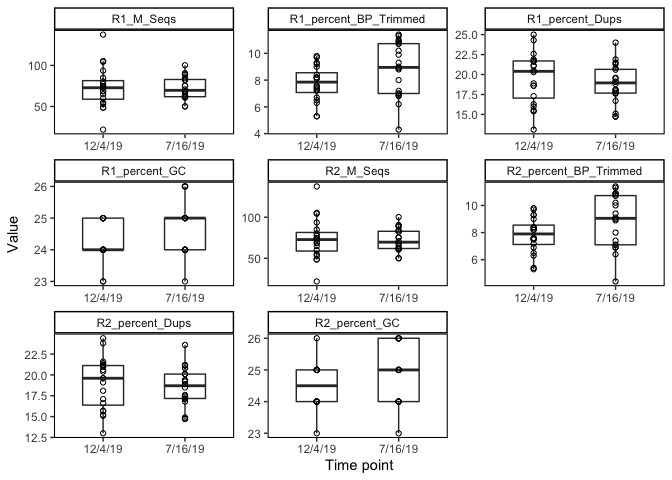
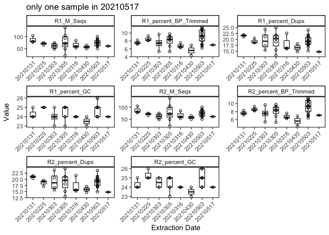
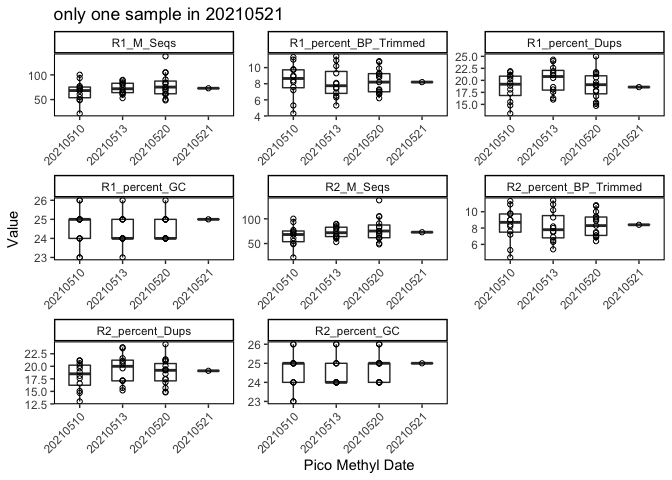

Methylseq statistics
================
EL Strand

Based on Kevin Wong’s methylseq analysis scripts.

``` r
# Read in required libraries
library("reshape")
#library(plyr)
library("dplyr")
```

    ## 
    ## Attaching package: 'dplyr'

    ## The following object is masked from 'package:reshape':
    ## 
    ##     rename

    ## The following objects are masked from 'package:stats':
    ## 
    ##     filter, lag

    ## The following objects are masked from 'package:base':
    ## 
    ##     intersect, setdiff, setequal, union

``` r
library("tidyverse")
```

    ## ── Attaching packages ─────────────────────────────────────── tidyverse 1.3.1 ──

    ## ✔ ggplot2 3.3.6     ✔ purrr   0.3.4
    ## ✔ tibble  3.1.7     ✔ stringr 1.4.0
    ## ✔ tidyr   1.2.0     ✔ forcats 0.5.1
    ## ✔ readr   2.1.2

    ## ── Conflicts ────────────────────────────────────────── tidyverse_conflicts() ──
    ## ✖ tidyr::expand() masks reshape::expand()
    ## ✖ dplyr::filter() masks stats::filter()
    ## ✖ dplyr::lag()    masks stats::lag()
    ## ✖ dplyr::rename() masks reshape::rename()

``` r
library("Rmisc")
```

    ## Loading required package: lattice

    ## Loading required package: plyr

    ## ------------------------------------------------------------------------------

    ## You have loaded plyr after dplyr - this is likely to cause problems.
    ## If you need functions from both plyr and dplyr, please load plyr first, then dplyr:
    ## library(plyr); library(dplyr)

    ## ------------------------------------------------------------------------------

    ## 
    ## Attaching package: 'plyr'

    ## The following object is masked from 'package:purrr':
    ## 
    ##     compact

    ## The following objects are masked from 'package:dplyr':
    ## 
    ##     arrange, count, desc, failwith, id, mutate, rename, summarise,
    ##     summarize

    ## The following objects are masked from 'package:reshape':
    ## 
    ##     rename, round_any

``` r
library(gridExtra)
```

    ## 
    ## Attaching package: 'gridExtra'

    ## The following object is masked from 'package:dplyr':
    ## 
    ##     combine

``` r
library(ggpubr)
```

    ## 
    ## Attaching package: 'ggpubr'

    ## The following object is masked from 'package:plyr':
    ## 
    ##     mutate

``` r
library(tidyverse)
library(ggplot2)
library(RColorBrewer)
library(lme4)
```

    ## Loading required package: Matrix

    ## 
    ## Attaching package: 'Matrix'

    ## The following objects are masked from 'package:tidyr':
    ## 
    ##     expand, pack, unpack

    ## The following object is masked from 'package:reshape':
    ## 
    ##     expand

``` r
library(lmerTest)
```

    ## 
    ## Attaching package: 'lmerTest'

    ## The following object is masked from 'package:lme4':
    ## 
    ##     lmer

    ## The following object is masked from 'package:stats':
    ## 
    ##     step

``` r
library(car)
```

    ## Loading required package: carData

    ## 
    ## Attaching package: 'car'

    ## The following object is masked from 'package:purrr':
    ## 
    ##     some

    ## The following object is masked from 'package:dplyr':
    ## 
    ##     recode

``` r
library(effects)
```

    ## Use the command
    ##     lattice::trellis.par.set(effectsTheme())
    ##   to customize lattice options for effects plots.
    ## See ?effectsTheme for details.

``` r
library(ggfortify)
library(cowplot)
```

    ## 
    ## Attaching package: 'cowplot'

    ## The following object is masked from 'package:ggpubr':
    ## 
    ##     get_legend

    ## The following object is masked from 'package:reshape':
    ## 
    ##     stamp

``` r
library(vegan)
```

    ## Loading required package: permute

    ## This is vegan 2.6-2

``` r
library(corrr)
library(ggcorrplot)
library(GGally)
```

    ## Registered S3 method overwritten by 'GGally':
    ##   method from   
    ##   +.gg   ggplot2

``` r
library(broom)
library(cowplot)
library(arsenal)
library(patchwork)
```

    ## 
    ## Attaching package: 'patchwork'

    ## The following object is masked from 'package:cowplot':
    ## 
    ##     align_plots

``` r
library(tidyr)
library(ggrepel)
```

Read in data

``` r
# load data
data <- read.csv("Dec-July-2019-analysis/output/WGBS/methylseq_stats.csv") %>% na.omit()

# Removing characters in columns and turning the values numeric
data$percent_Aligned <- as.numeric(sub("%","",data$percent_Aligned))
data$percent_Dups <- as.numeric(sub("%","",data$percent_Dups))
data$percent_Aligned <- as.numeric(sub("%","",data$percent_Aligned))
data$percent_mCHG <- as.numeric(sub("%","",data$percent_mCHG))
data$percent_mCHH <- as.numeric(sub("%","",data$percent_mCHH))
data$percent_mCpG <- as.numeric(sub("%","",data$percent_mCpG))
data$R1_percent_BP_Trimmed <- as.numeric(sub("%","",data$R1_percent_BP_Trimmed))
data$R1_percent_Dups <- as.numeric(sub("%","",data$R1_percent_Dups))
data$R1_percent_GC <- as.numeric(sub("%","",data$R1_percent_GC))
data$R2_percent_BP_Trimmed <- as.numeric(sub("%","",data$R2_percent_BP_Trimmed))
data$R2_percent_Dups <- as.numeric(sub("%","",data$R2_percent_Dups))
data$R2_percent_GC <- as.numeric(sub("%","",data$R2_percent_GC))

data$Mean_cov <- as.numeric(sub("X","",data$Mean_cov))
data$Median_cov <- as.numeric(sub("X","",data$Median_cov))

data$EXT_Date <- as.character(data$EXT_Date)
data$PMS_Date <- as.character(data$PMS_Date)
```

Plotting

``` r
data %>% select(1:19) %>%
  gather(measurement, value, 11:19) %>%
  ggplot(., aes(x=Bleach, y=value)) +
  geom_boxplot(width=.5, outlier.shape= NA, position = position_dodge(width = 0.5), alpha = 0.7) +
  geom_point(pch = 21) +
  xlab("Phenotype") +  
  ylab("Value") + #Axis titles
  theme_classic() + 
  theme(panel.border = element_rect(color="black", fill=NA, size=0.75), 
        panel.grid.major = element_blank(), #Makes background theme white
        panel.grid.minor = element_blank(), 
        axis.line = element_blank()) +
  facet_wrap(~ measurement, scales = "free")
```

<!-- -->

``` r
data %>% select(1:19) %>%
  gather(measurement, value, 11:19) %>%
  ggplot(., aes(x=Date, y=value)) +
  geom_boxplot(width=.5, outlier.shape= NA, position = position_dodge(width = 0.5), alpha = 0.7) +
  geom_point(pch = 21) +
  xlab("Time point") +  
  ylab("Value") + #Axis titles
  theme_classic() + 
  theme(panel.border = element_rect(color="black", fill=NA, size=0.75), 
        panel.grid.major = element_blank(), #Makes background theme white
        panel.grid.minor = element_blank(), 
        axis.line = element_blank()) +
  facet_wrap(~ measurement, scales = "free")
```

<!-- -->

``` r
data %>% select(1:19) %>%
  gather(measurement, value, 11:19) %>%
  ggplot(., aes(x=EXT_Date, y=value)) +
  geom_boxplot(width=.5, outlier.shape= NA, position = position_dodge(width = 0.5), alpha = 0.7) +
  geom_point(pch = 21) +
  xlab("Extraction Date") +  
  ylab("Value") + #Axis titles
  theme_classic() + 
  ggtitle("only one sample in 20210517") +
  theme(panel.border = element_rect(color="black", fill=NA, size=0.75), 
        panel.grid.major = element_blank(), #Makes background theme white
        panel.grid.minor = element_blank(), 
        axis.line = element_blank(),
        axis.text.x = element_text(angle = 45, hjust = 1)) +
  facet_wrap(~ measurement, scales = "free")
```

<!-- -->

``` r
data %>% select(1:19) %>%
  gather(measurement, value, 11:19) %>%
  ggplot(., aes(x=PMS_Date, y=value)) +
  geom_boxplot(width=.5, outlier.shape= NA, position = position_dodge(width = 0.5), alpha = 0.7) +
  geom_point(pch = 21) +
  ggtitle("only one sample in 20210521") +
  xlab("Pico Methyl Date") +  
  ylab("Value") + #Axis titles
  theme_classic() + 
  theme(panel.border = element_rect(color="black", fill=NA, size=0.75), 
        panel.grid.major = element_blank(), #Makes background theme white
        panel.grid.minor = element_blank(), 
        axis.line = element_blank(),
        axis.text.x = element_text(angle = 45, hjust = 1)) +
  facet_wrap(~ measurement, scales = "free")
```

<!-- -->

``` r
data %>% select(1:10, 20:27) %>%
  gather(measurement, value, 11:18) %>%
  ggplot(., aes(x=Bleach, y=value)) +
  geom_boxplot(width=.5, outlier.shape= NA, position = position_dodge(width = 0.5), alpha = 0.7) +
  geom_point(pch = 21) +
  xlab("Phenotype") +  
  ylab("Value") + #Axis titles
  theme_classic() + 
  theme(panel.border = element_rect(color="black", fill=NA, size=0.75), 
        panel.grid.major = element_blank(), #Makes background theme white
        panel.grid.minor = element_blank(), 
        axis.line = element_blank()) +
  facet_wrap(~ measurement, scales = "free")
```

<!-- -->

``` r
data %>% select(1:10, 20:27) %>%
  gather(measurement, value, 11:18) %>%
  ggplot(., aes(x=Date, y=value)) +
  geom_boxplot(width=.5, outlier.shape= NA, position = position_dodge(width = 0.5), alpha = 0.7) +
  geom_point(pch = 21) +
  xlab("Time point") +  
  ylab("Value") + #Axis titles
  theme_classic() + 
  theme(panel.border = element_rect(color="black", fill=NA, size=0.75), 
        panel.grid.major = element_blank(), #Makes background theme white
        panel.grid.minor = element_blank(), 
        axis.line = element_blank()) +
  facet_wrap(~ measurement, scales = "free")
```

<!-- -->

``` r
data %>% select(1:10, 20:27) %>%
  gather(measurement, value, 11:18) %>%
  ggplot(., aes(x=EXT_Date, y=value)) +
  geom_boxplot(width=.5, outlier.shape= NA, position = position_dodge(width = 0.5), alpha = 0.7) +
  geom_point(pch = 21) +
  xlab("Extraction Date") +  
  ylab("Value") + #Axis titles
  theme_classic() + 
  ggtitle("only one sample in 20210517") +
  theme(panel.border = element_rect(color="black", fill=NA, size=0.75), 
        panel.grid.major = element_blank(), #Makes background theme white
        panel.grid.minor = element_blank(), 
        axis.line = element_blank(),
        axis.text.x = element_text(angle = 45, hjust = 1)) +
  facet_wrap(~ measurement, scales = "free")
```

<!-- -->

``` r
data %>% select(1:10, 20:27) %>%
  gather(measurement, value, 11:18) %>%
  ggplot(., aes(x=PMS_Date, y=value)) +
  geom_boxplot(width=.5, outlier.shape= NA, position = position_dodge(width = 0.5), alpha = 0.7) +
  geom_point(pch = 21) +
  ggtitle("only one sample in 20210521") +
  xlab("Pico Methyl Date") +  
  ylab("Value") + #Axis titles
  theme_classic() + 
  theme(panel.border = element_rect(color="black", fill=NA, size=0.75), 
        panel.grid.major = element_blank(), #Makes background theme white
        panel.grid.minor = element_blank(), 
        axis.line = element_blank(),
        axis.text.x = element_text(angle = 45, hjust = 1)) +
  facet_wrap(~ measurement, scales = "free")
```

<!-- -->

Statistics

``` r
data2 <- data %>% unite(Group, Bleach, Date, sep = " ") %>%
  select(7, 10:26)

tableby_Group <- tableby(Group ~., data = data2)
summary(tableby_Group)
```

    ## 
    ## 
    ## |                            | Bleach 12/4/19 (N=10) | Bleach 7/16/19 (N=10) | Non-bleach 12/4/19 (N=10) | Non-bleach 7/16/19 (N=10) |    Total (N=40)    | p value|
    ## |:---------------------------|:---------------------:|:---------------------:|:-------------------------:|:-------------------------:|:------------------:|-------:|
    ## |**percent_mCpG**            |                       |                       |                           |                           |                    |   0.007|
    ## |&nbsp;&nbsp;&nbsp;Mean (SD) |    12.820 (0.603)     |    12.290 (0.428)     |      12.560 (0.353)       |      12.080 (0.449)       |   12.438 (0.530)   |        |
    ## |&nbsp;&nbsp;&nbsp;Range     |    11.600 - 13.600    |    11.500 - 12.800    |      12.100 - 13.100      |      11.300 - 12.800      |  11.300 - 13.600   |        |
    ## |**percent_mCHG**            |                       |                       |                           |                           |                    |   0.670|
    ## |&nbsp;&nbsp;&nbsp;Mean (SD) |     0.600 (0.000)     |     0.630 (0.095)     |       0.620 (0.063)       |       0.640 (0.097)       |   0.622 (0.073)    |        |
    ## |&nbsp;&nbsp;&nbsp;Range     |     0.600 - 0.600     |     0.600 - 0.900     |       0.600 - 0.800       |       0.600 - 0.900       |   0.600 - 0.900    |        |
    ## |**percent_mCHH**            |                       |                       |                           |                           |                    |   0.165|
    ## |&nbsp;&nbsp;&nbsp;Mean (SD) |     0.670 (0.048)     |     0.750 (0.108)     |       0.690 (0.088)       |       0.750 (0.127)       |   0.715 (0.100)    |        |
    ## |&nbsp;&nbsp;&nbsp;Range     |     0.600 - 0.700     |     0.600 - 1.000     |       0.600 - 0.900       |       0.700 - 1.100       |   0.600 - 1.100    |        |
    ## |**M_Cs**                    |                       |                       |                           |                           |                    |   0.297|
    ## |&nbsp;&nbsp;&nbsp;Mean (SD) |   696.070 (218.093)   |   554.080 (85.137)    |     660.170 (212.230)     |     663.370 (139.478)     | 643.423 (174.539)  |        |
    ## |&nbsp;&nbsp;&nbsp;Range     |  218.300 - 1003.600   |   411.500 - 698.100   |    459.800 - 1202.100     |     442.600 - 855.300     | 218.300 - 1202.100 |        |
    ## |**percent_Dups**            |                       |                       |                           |                           |                    |   0.280|
    ## |&nbsp;&nbsp;&nbsp;Mean (SD) |    13.520 (3.376)     |    12.070 (2.592)     |      11.230 (1.517)       |      12.430 (2.590)       |   12.312 (2.637)   |        |
    ## |&nbsp;&nbsp;&nbsp;Range     |    7.500 - 18.600     |    8.000 - 17.200     |      9.200 - 13.500       |      10.100 - 18.000      |   7.500 - 18.600   |        |
    ## |**percent_Aligned**         |                       |                       |                           |                           |                    |   0.146|
    ## |&nbsp;&nbsp;&nbsp;Mean (SD) |    33.050 (1.353)     |    31.950 (1.728)     |      33.160 (0.909)       |      31.950 (1.933)       |   32.528 (1.584)   |        |
    ## |&nbsp;&nbsp;&nbsp;Range     |    31.000 - 34.800    |    29.200 - 33.800    |      32.100 - 35.000      |      27.800 - 34.100      |  27.800 - 35.000   |        |
    ## |**Ins_size**                |                       |                       |                           |                           |                    | < 0.001|
    ## |&nbsp;&nbsp;&nbsp;Mean (SD) |    165.100 (8.647)    |   146.400 (14.931)    |      160.700 (7.288)      |      148.400 (7.604)      |  155.150 (12.606)  |        |
    ## |&nbsp;&nbsp;&nbsp;Range     |   157.000 - 181.000   |   130.000 - 180.000   |     148.000 - 169.000     |     134.000 - 160.000     | 130.000 - 181.000  |        |
    ## |**Median_cov**              |                       |                       |                           |                           |                    |   0.431|
    ## |&nbsp;&nbsp;&nbsp;Mean (SD) |     4.900 (1.663)     |     4.000 (0.667)     |       4.700 (1.703)       |       4.900 (1.287)       |   4.625 (1.390)    |        |
    ## |&nbsp;&nbsp;&nbsp;Range     |     1.000 - 7.000     |     3.000 - 5.000     |       3.000 - 9.000       |       3.000 - 7.000       |   1.000 - 9.000    |        |
    ## |**Mean_cov**                |                       |                       |                           |                           |                    |   0.473|
    ## |&nbsp;&nbsp;&nbsp;Mean (SD) |     6.360 (2.011)     |     5.360 (0.792)     |       6.120 (2.042)       |       6.380 (1.356)       |   6.055 (1.625)    |        |
    ## |&nbsp;&nbsp;&nbsp;Range     |     2.000 - 9.200     |     4.200 - 6.700     |      4.400 - 11.400       |       4.200 - 8.400       |   2.000 - 11.400   |        |
    ## |**R1_percent_BP_Trimmed**   |                       |                       |                           |                           |                    |   0.197|
    ## |&nbsp;&nbsp;&nbsp;Mean (SD) |     7.590 (1.550)     |     9.200 (2.161)     |       7.930 (1.081)       |       8.360 (1.888)       |   8.270 (1.760)    |        |
    ## |&nbsp;&nbsp;&nbsp;Range     |     5.300 - 9.800     |    4.300 - 11.300     |       6.300 - 9.700       |      6.200 - 11.400       |   4.300 - 11.400   |        |
    ## |**R1_percent_Dups**         |                       |                       |                           |                           |                    |   0.187|
    ## |&nbsp;&nbsp;&nbsp;Mean (SD) |    20.840 (3.461)     |    18.610 (2.001)     |      18.310 (2.419)       |      19.080 (2.923)       |   19.210 (2.828)   |        |
    ## |&nbsp;&nbsp;&nbsp;Range     |    13.100 - 25.000    |    14.800 - 21.500    |      15.400 - 21.600      |      14.700 - 24.000      |  13.100 - 25.000   |        |
    ## |**R1_percent_GC**           |                       |                       |                           |                           |                    |   0.264|
    ## |&nbsp;&nbsp;&nbsp;Mean (SD) |    24.200 (0.789)     |    24.900 (0.876)     |      24.500 (0.527)       |      24.500 (0.850)       |   24.525 (0.784)   |        |
    ## |&nbsp;&nbsp;&nbsp;Range     |    23.000 - 25.000    |    23.000 - 26.000    |      24.000 - 25.000      |      24.000 - 26.000      |  23.000 - 26.000   |        |
    ## |**R1_M_Seqs**               |                       |                       |                           |                           |                    |   0.553|
    ## |&nbsp;&nbsp;&nbsp;Mean (SD) |    75.880 (24.704)    |    66.430 (8.924)     |      70.900 (25.854)      |      78.460 (15.890)      |  72.918 (19.842)   |        |
    ## |&nbsp;&nbsp;&nbsp;Range     |   21.800 - 105.400    |    49.900 - 82.400    |     48.400 - 137.500      |     50.300 - 100.200      |  21.800 - 137.500  |        |
    ## |**R2_percent_BP_Trimmed**   |                       |                       |                           |                           |                    |   0.186|
    ## |&nbsp;&nbsp;&nbsp;Mean (SD) |     7.640 (1.525)     |     9.250 (2.138)     |       8.000 (1.086)       |       8.430 (1.811)       |   8.330 (1.729)    |        |
    ## |&nbsp;&nbsp;&nbsp;Range     |     5.300 - 9.800     |    4.400 - 11.300     |       6.300 - 9.700       |      6.400 - 11.400       |   4.400 - 11.400   |        |
    ## |**R2_percent_Dups**         |                       |                       |                           |                           |                    |   0.219|
    ## |&nbsp;&nbsp;&nbsp;Mean (SD) |    20.230 (3.355)     |    18.330 (1.972)     |      17.800 (2.357)       |      18.690 (2.740)       |   18.762 (2.711)   |        |
    ## |&nbsp;&nbsp;&nbsp;Range     |    13.000 - 24.400    |    14.700 - 21.200    |      15.100 - 21.000      |      14.800 - 23.600      |  13.000 - 24.400   |        |
    ## |**R2_percent_GC**           |                       |                       |                           |                           |                    |   0.279|
    ## |&nbsp;&nbsp;&nbsp;Mean (SD) |    24.400 (0.843)     |    25.100 (0.994)     |      24.600 (0.516)       |      24.600 (0.843)       |   24.675 (0.829)   |        |
    ## |&nbsp;&nbsp;&nbsp;Range     |    23.000 - 26.000    |    23.000 - 26.000    |      24.000 - 25.000      |      24.000 - 26.000      |  23.000 - 26.000   |        |
    ## |**R2_M_Seqs**               |                       |                       |                           |                           |                    |   0.553|
    ## |&nbsp;&nbsp;&nbsp;Mean (SD) |    75.880 (24.704)    |    66.430 (8.924)     |      70.900 (25.854)      |      78.460 (15.890)      |  72.918 (19.842)   |        |
    ## |&nbsp;&nbsp;&nbsp;Range     |   21.800 - 105.400    |    49.900 - 82.400    |     48.400 - 137.500      |     50.300 - 100.200      |  21.800 - 137.500  |        |
